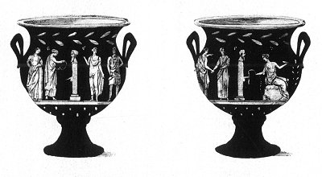

  
[Intangible Textual Heritage](../../index)  [Sacred
Sexuality](../index)  [Classics](../../cla/index)  [Index](index) 
[Previous](rmn59)  [Next](rmn61) 

------------------------------------------------------------------------

 

   
Plate LIX

 

p. 120

# Bell-shaped Vase.

PLATE LIX.

IN both sides of this campana may be seen male and female Bacchants
offering crowns and garlands to Priapus. It is easy here to recognise
the hierophant, the Bacchus, the priest entrusted with the ablutions,
and the female Bacchants.

The figures are well executed. They bear *peplos* or *chlamydes*
skilfully draped.

Of all the writers who have declaimed against the immodesty of the Pagan
deities, few have done so with such force as Arnobius. Here is a rather
curious fragment of his *Treatise on the Images of the Gods* (*de Deorum
Simulacris*):--

"Why should I thus laugh at the false gods, at their horns; and
ridiculous attributes, when I am well aware that they represent the
habits of certain men and the features of certain infamous courtezans?
Who does not know that the Athenians fashioned their Mercuries in
imitation of the body of Alcibiades? And who, on looking again into
Posidippus, does not know that Praxiteles sculptured the Gnidian Venus
after the courtezan Gratina, with whom the unfortunate sculptor was
madly in love? But this Venus is not the only one whose face reproduces
the features of a prostitute. Phryne herself, at the period when her
beauty shone in all its splendour, and her youth was in

p. 121

all its freshness, served, it is said, as a model for the diverse
figures of Venus, whether in the Greek cities or elsewhere where the
worship of idols was admitted. The artists of that period strove in turn
to surpass each other in reproducing the likeness of this courtezan in
their statues of Venus, not in order that the goddess might become more
august by it, but in order that Phryne might pass for the real Venus.
The thing was carried so far that prostitutes received the sacrifices
due to the immortal gods. We may cite the example of the celebrated
Phidias, who, having made a statue of colossal size of Jupiter Olympius,
graved on the finger of the god the name of a young and beautiful youth
for whom he cherished an obscene passion . . . . .

"Thus, in bestowing a sex on the gods, if we invest them with the male
organs of generation, we must expect to see them abandon themselves to
acts which a chaste tongue could not even name. We must see them fired
with passion like animals, wallow in the most degraded libertinism, and
at last sink down into lassitude, weakened by excess of enjoyment;
while, if we attribute the feminine sex to them, we must imagine the
goddesses subject to the inconveniences of monthly terms, long and
troublesome child-bearings, occasional abortions, and dreadful
sufferings in their accouchement, &c."

------------------------------------------------------------------------

[Next: Plate LX: Langelle Vase](rmn61)
