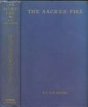
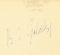
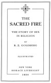
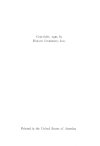

  
[Intangible Textual Heritage](../../index.md)  [Sacred
Sexuality](../index)  [Index](index)  [Next](tsf01.md) 

------------------------------------------------------------------------

[Buy this Book at
Amazon.com](https://www.amazon.com/exec/obidos/ASIN/0806504560/internetsacredte.md)

------------------------------------------------------------------------

*The Sacred Fire*, by B.Z. Goldberg, \[1930\], at Intangible Textual
Heritage

------------------------------------------------------------------------

# THE

# SACRED FIRE

### THE STORY OF SEX

### IN RELIGION

###### BY

## B. Z. GOLDBERG

##### ILLUSTRATED

#### NEW YORK

#### HORACE LIVERIGHT

#### 1930

[  
Click to enlarge](img/cover.jpg.md)  
Front Cover and Spine  

[  
Click to enlarge](img/autogr.jpg.md)  
Autograph of Author  

[  
Click to enlarge](img/title.jpg.md)  
Title Page  

[  
Click to enlarge](img/verso.jpg.md)  
Verso  

IMPORTANT NOTICE  
This text was public domain in the US from 1980 until 1998, but its
copyright was formally restored under the terms of the DMCA. THIS TEXT
IS CURRENTLY NOT IN THE PUBLIC DOMAIN IN THE US. This text is presented
here for non-commercial, research purposes only. The current copyright
holder is welcome to contact sacred-texts and we will comply with their
wishes. DO NOT REPRODUCE THIS MATERIAL COMMERCIALLY.

To

MAROUSSIA

------------------------------------------------------------------------

[Next: Contents](tsf01.md)
