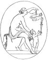
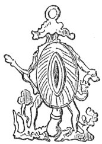
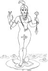
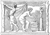
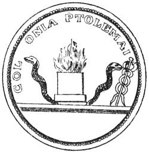

  
[Intangible Textual Heritage](../../index)  [Sacred
Sexuality](../index)  [Index](index)  [Previous](tsf04)  [Next](tsf06) 

------------------------------------------------------------------------

[Buy this Book at
Amazon.com](https://www.amazon.com/exec/obidos/ASIN/0806504560/internetsacredte)

------------------------------------------------------------------------

*The Sacred Fire*, by B.Z. Goldberg, \[1930\], at Intangible Textual
Heritage

------------------------------------------------------------------------

p. 38

### CHAPTER III

### IN THE FOUNDRY OF THE GODS

<table data-border="0">
<colgroup>
<col style="width: 100%" />
</colgroup>
<tbody>
<tr class="odd">
<td data-valign="top">
<em>In his own image 
He created his god</em>
</td>
</tr>
</tbody>
</table>

#### I

THERE is a sacred corner in every dwelling—even the humblest—in the
East. Whatever the hut may lack—and it will be lacking in most modern
comforts of the home—it will not be without its little shrine. There is
sure to be an icon, an image of a saint, graven or in paint, standing on
a plain triangular piece of board which is set in between two walls of
the house.

Before it there is ever a light burning. The woman of the house will not
fail the shrine. The last morsel of bread may be gone from the larder,
but never the last drop of oil or piece of tallow to keep the fire
burning before the eyes of the saint, who, in turn, will never fail the
family of the house. Times may be hard, life scarcely bearable.
Starvation, illness, death itself, may stalk within, but dark as it all
may be, the family is never without the consolation and hope that the
graven image brings. In the humblest dwelling of the East there is
always a light—a light that never fails, physically or symbolically.

There is an eternal light ceaselessly burning before the Holy Ark of the
synagogue, there is a light over the altar

p. 39

of the church, there is one illuminating the crescent of the mosque.
Similarly, there was a light upon the hearth in ancient times. Whenever
man had a light within him, he lit a fire outside of him. So long as
there is faith in the world, so long will the light kindled many
thousands of years ago never fail.

The universal, eternal light is symbolic of universal, eternal life.
Primitive people seem to have felt it, somehow. It dawned upon them as
they produced their fire, rubbing together two pieces of wood, one laid
upon the ground and the other held vertically upon it. This action being
so suggestive and the result analogous to life, the two sticks have been
associated with the two life forces and their use has almost universally
received a sexual interpretation.

Somewhere, somehow, life began. Whether it was by the word of God: "Let
there be" and it was; whether it came flying across space from another
planet; whether it began as an accidental chemical mixture; however life
came into the world, it has never ceased to be. Living objects perish,
life never dies. The life of an individual comes to an end; families die
out, tribes, races; but the human species lives on, the stream of life
never stops. It flows on and on forever, from its inception in the
formative period of our planet, through its tributaries of the countless
species of living forms—plants or animals.

When living things were small, consisting of a single microscopic cell,
life was continued by growth. The amoeba grew so big that it split in
two; it exchanged its single old age for a double life of youth. An
amoeba could be destroyed but it would never die.

This tiny bit of life grew larger and, in time, when it

p. 40

split, the two parts stuck together instead of separating. It was no
longer unicellular; it became a group of cells working together. Then
specialization set in. Some parts of the animal undertook its
locomotion, others did the digesting, still others concerned themselves
with continuing the life that was in the living being. These were the
sex

[  
Click to enlarge](img/04000.jpg)  
Venus and Cupid fulfilling their mission of love  

cells. Their function was to perpetuate the light of life so that it
might never fail.

At first, their work was simple; they merely grew into another being.
Again specialization set in—the sex cells developed variously, becoming
male and female. They must now be united before a new creature could
come into existence. But they still grew on the same body. In time,

p. 41

the organism had only one kind of cell, either male or female. So it was
that out of sex emerged the sex cells and out of sex cells came the
sexes.

Prometheus stole the fire from the gods and brought it down as a gift to
mankind. That fire is still kept burning and will ever go on warming and
enlightening the world. Venus sprang from the foam of the sea and is
forever serving those who are in love; so life sprang from among the
streams and mists of the deep, when the earth was in its formative
state, and is now being continued to the end of time by the agency of
sex.

#### II

When Old Anthropology Adam let his mind speculate on sex, he did not see
it as the continuity of life. This latter idea is of more recent date,
having been borne in on the waves of evolution. It is still rather new
to the man in the street. To Old Adam, sex was a force bringing new
life. A baby was born in the tribe, an offspring came to an animal in
the herd, new blossoms appeared upon the branches of the tree, presaging
new fruit. There was someone behind all this, some mysterious force
giving life. Like all great forces in nature it was a god—a god
unseen—the god of sex and birth.

How did primitive man conceive of this new god? His concept of the sex
divinity follows a course similar to the course of the development of
sex in nature. This new god was originally neither male nor female, but
just sex. It was the generative force, not the generator or reproducer.
He conceived it as the sex organs, the lingam and yoni in union, minus
the bodies. There was little or no regard as yet for the individuals who
bore these organs.

p. 42

In India, a smooth, round stone, rising out of another formed like an
elongated saucer, suggestive of the lingam and yoni in union,
represented the powerful divinity, Siva. A favorite god in Southern
Celebes is Karaeng lowe. He is a powerful spirit figured under the form
of the lingam and yoni in union. In Celebes, too, images of the
generative organs are found on the posts of houses raised in honor of
the fallen warriors. The Brahmans represent this union by a cylinder
hanging from a vase which is set into a pedestal. The vase represents
the goddess, the yoni, and the cylinder the god, the lingam. Cakes
kneaded in the form of the lingam and yoni were eaten at the marriage
rite of the Greeks. The Bayanzi in the Congo basin mold these images out
of clay and adorn them with feathers.

Representations of the lingam and yoni were current all over Europe. As
late as the sixteenth century these figures, made of wax, were offered
to Saint Foutin at Varailles in Provence, France. They were suspended
from the ceiling of his chapel and were so numerous that when the wind
stirred them, the lingam struck against the yoni, to the apparent
disturbance of the faithful at their devotions.

   
A Phallic amulet

p. 43

#### III

Later, man came to seek his god of generation, not in the union of the
sex organs, but in these organs themselves. He deified the male or
female in man and animal. An old Egyptian legend offers an explanation
of how the lingam came to be worshipped: Isis and Osiris were powerful
gods of the Egyptian hierarchy. They were brother, and sister. They were
also husband and wife. When Osiris was murdered by Typhon and his body
cut up and scattered in all directions, Isis went about collecting the
parts. She found all of them except his lingam. For a long time she
continued her search, but never did she come upon a trace of it. So she
finally caused a wooden lingam to be made and this image she held as
very sacred. That is how the lingam, in wood or stone, came to be so
common in Egypt.

Now, man has always sought to elaborate his house of worship. Pyramid,
pagoda, or steeple, do not primarily serve a utilitarian purpose. They
are there to lend glory to the divinity and to impress the onlooker with
the sacredness of the place. In like manner, Old Anthropology Adam
elaborated his figures of lingam and yoni, not only with artistic
decorations, but with bodies of tremendous proportions and striking
appearance. The lingam and yoni remained the miniature representations
of the generative divinity; the male and female figures came to be the
full images of the gods of fertility.

Here again the evolution of the generative god followed the development
of sex in nature. As man came to clothe his sex god with the human form,
he had one individual contain both sex organs. Janus of the Greeks was
not only double-headed, but also double-sexed, hermaphroditic,

p. 44

like a plant that produces both stamens and pistils in the same floral
envelope. Siva, the great god of India, is the

[  
Click to enlarge](img/04400.jpg)  
Brahma created himself double, both male and female  

\[paragraph continues\] Reproducer. He was
originally a single substance; but of his own free will he divided
himself into male and female.

p. 45

We find a similar development in the story of Purusa, the Soul of the
Universe. At first, Purusa was alone. "He did not enjoy happiness, he
desired a second being. So he caused himself to fall asunder in two
parts. Thence arose a husband and a wife. From them men were born. But
she reflected, 'How does he, after having produced me from himself,
cohabit with me?' So she became a cow, but he became a bull; from them
kine were produced. Then she became a mare and he turned himself into a
stallion. From them the whole family of animals with undivided hoofs
were produced. In this manner, pairs of all creatures, whatsoever, down
to ants, came into the world."

But the hermaphroditic gods were only a transition in the development of
the individuals, male and female gods, and, as such, they were
short-lived. They persisted into classical times, but only under the
veil of mysticism for exotic natures. Creating his gods in his own
image, man began to conceive of them as male or female, like the men and
women serving them. We now have male and female gods.

The Ewhe of West Africa make an image of red clay which rudely
represents the human figure. "It is generally male, rarely female, and
always entirely nude. It is always represented as squatting down and
looking at the lingam, which is enormously disproportionate. When
female, the figure is provided with long pointed breasts and the
necessary adjuncts."

In the Babar Archipelago, there is a festival, Upu-lero, in honor of the
sun. "An emblem of the generative force of the sun is erected in the
form of a standard flying a pennant of white cotton almost five feet
long. The pennant is cut in the form of a man, and fastened to it, a
lingam

p. 46

and scrotum, an apt suggestion of the orgies enacted below."

At every turn, we run into more of these male and female gods. In the
forests of central Africa, there are little rustic temples made of
palm-fronds and poles. Within them male and female figures, nearly
life-size, with overemphasized sex organs, represent the generative
principles.

The Roman god, Priapus, was represented in passion, and every bride of
Roman aristocracy was supposed to sacrifice her virginity to him. To
quote Saint Augustine: "This custom was once regarded as very honest and
religious by Roman women, who obliged the young brides to come and sit
upon the masculine monstrosity representing Priapus." The Babylonian
goddess, Mylitta, or the Greek Aphrodite was represented as a naked
woman, the acme of allurement, according to the tastes and standards of
the times in art and love.

There is a beautiful legend symbolic of the evolutionary way in which
man created his god of generation: The sky was the father and the earth
was the mother; the two were forever lying in union, the sky weighing
down upon the earth. Whatever offspring resulted therefrom were
smothered by the weight of the father. But one day, one of the sons
managed to work his way out, so he pierced the sky with his spear,
raising it high above the earth. The pair were separated, but they were
no longer fruitful. Another son, realizing the cause of the parents'
sterility, carne and married them according to the rite of the tribe.

Once primitive man conceived birth and generation as a divine process,
he naturally looked upon the male and female gods as its joint agents.
Consequently, when he was desirous of regeneration, it occurred to him
to marry

p. 47

these gods, so that universal birth might follow the divine union, just
as the birth of children follows the union of man and woman.

Testimony of this survives. At Calah, the old Assyrian capital, the
marriage of the god Nabu appears to have been annually celebrated on the
third day of the month Iyyar, which corresponds to May. The marriage of
Zeus and Hera was performed annually in various parts - of Greece. Among
the Bambara of the Niger Basin in West Africa, the male and female idols
are believed to couple at the time of the annual sacrifices offered
before the rainy season. This marriage of the gods may have been
accomplished by imitative magic. Without appealing directly to them, or
participating in their life, man could perform an act which would be a
suggestion the gods were bound to take. In other words, he could marry
the gods by marrying himself. Human copulation would bring about
copulation of the generative gods, wherever they might be, and thereby
bring fertility to the world.

Suggestion was also resorted to by the people of Central America even to
the time when the white men first visited them. When planting time came,
they were extremely anxious that the sowing of the seed be done in a
most auspicious hour for generation. Four days previously, therefore,
the men separated from their wives in order that on the night preceding
the planting they might indulge their passions to the fullest extent.
This intercourse was even enjoined upon the people by the priest as a
religious duty, in default of which it was not lawful to sow the seed.
Certain persons are even said to have been designated and appointed to
join in sexual union at the very moment when the first seed was
deposited in the ground.

p. 48

Even today in some parts of Java, when the season of the blossom on the
rice is at hand, the husbandman and his wife visit their fields after
dark and unite for the purpose of promoting the growth of the crop. It
is a form of mana, a magical way of getting the generative divinities to
do likewise and to bless the world with fertility.

Sometimes the suggestion is extended through persons who seem already to
be in favor with the generative gods.

[  
Click to enlarge](img/04800.jpg)  
At the altar of Priapus  

\[paragraph continues\] Having received
the blessing of the fertility divinities, they are in themselves
fertility gods in a small way. Among the Baganda of Central Africa, the
birth of twins is the sign of a godlike power of fertility. Some little
time after the twins are born, a ceremony is performed which is supposed
to transfer the fertility powers of the parents to the plantains. In
this ceremony the mother lies down in the thick grass near the house and
places a flower of the plantain between her legs. Then the husband comes
and

p. 49

brushes the flower away with his lingam. After this, the parents may go
through the country, performing dances in the gardens of friends and
favored people, spreading the abundance of their fertility powers.

#### IV

If man arranged the marriage of the gods we should not be surprised to
find him inviting himself to the wedding and participating in it. A
ceremony of this nature survives among some of the tribes of Africa. The
inhabitants believe in the sun as the male god and the earth as the
female. Once a year, at the beginning of the rainy season, the marriage
of the two takes place. On this occasion, pigs and dogs are sacrificed
in profusion; and the men and women indulge in saturnalia. During the
ceremonies the sun is supposed to come down into the holy fig tree to
fertilize the earth. To facilitate his descent, a ladder with seven
rungs is considerately placed at his disposal. It is set up under a tree
and adorned with carved figures of the birds whose shrill clarions
herald the approach of the sun in the east. For all that, the marriage
of the sun and earth is too abstract for the primitive mind.
Consequently, this mystic union is dramatically represented in public by
individuals taking the parts of the divinities, amid song and dance and
by real union of the sexes under the tree.

The Oraons of Bengal celebrate the marriage of heaven and earth by
remarrying their village priest and his wife. After the marriage
ceremony, all eat and drink and make merry; they dance and sing frank
love songs and finally indulge in the wildest orgies with the sole
object of making mother earth fruitful.

p. 50

Similarly, long ago the marriage of the sky god Zeus to the grain
goddess, Demeter, was represented by the union of a priestess of Demeter
and a hierophant. The torches were extinguished and the pair descended
into a murky place, while the throng of worshippers awaited in anxious
suspense the result of the mystic union, upon which they believed their
salvation depended. After a time the hierophant reappeared and, in the
blaze of the night, silently exhibited an ear of corn—the fruit of
divine marriage. However, their intercourse was only dramatic and
symbolical, since the hierophant incapacitated himself by the
application of hemlock.

Sometimes only one of the gods needed to be thus substituted as the
other one was already concretely represented in animate or inanimate
form. When the natives of Bengal marry their male god to the goddess of
water, they make an image of the male in wood and immerse it in the
water. In this way the two are united and the well which has been thus
consecrated will ever be an abundant source of water.

The Indians of Peru had a god in human form done in stone. This idol
they would wed to a beautiful maiden of fourteen years. All the
villagers took part in the ceremony, which lasted for three days and was
attended with great revelry. The girl thereafter remained a virgin and
sacrificed to the idol for the people.

Not always, however, did the consort of the god remain untouched in her
marriage. The Akikuyu of British East Africa even today worship the
snake of a certain river and, at intervals of several years, they marry
the snake god to women, especially to young girls. For this purpose,
huts are built by order of the medicine men who consummate

p. 51

the sacred marriage with the credulous female devotees. If the girls do
not repair to the huts of their own accord in sufficient numbers, they
are seized and dragged thither to the embrace of the deity. The
offspring of these mystic unions are fathered by the god, and there are
many youngsters among these people who pass as children of the divinity.

In the temples of Egypt, a woman slept near the image of Ammon as his
"divine consort" and was said to have no intercourse with a man. It was
the queen herself usually, since the kings of Egypt were actually
begotten by Ammon, who cohabited with the queen in the assumed form of
the reigning pharaoh. In Babylon, a woman was kept in the lofty temple
of Bel as his wife. This is how the temple priestesses came into being.
In India today, where prostitutes are attached to a temple, they are
first married to a god.

It is not altogether unusual for a priest to represent the god in his
conjugal activities. In tribes where virginity is sacred, it is the god
who is to deflower the maidens. He operates through his priests, who
charge a fee for this divine service. Poor girls who cannot afford the
fee may grow into spinsterhood, since no one will marry them unless they
have been deflowered in the temple. A vestige of this rite we could find
in Europe down to quite modern times in the so-called *jus primae
noctis*, the right to the bride for the first night, which belonged to
the lord of the manor. Every maiden living on his land was to offer
herself to him before she joined her husband. Sometimes he would
relinquish this right for a price; at others, he would insist upon it.

Not every marriage of a human with a god ended in

p. 52

happiness. Sometimes it was fatal to the maiden--like the bee, once he
mates with the queen, he must die. So it is in the Maldive Islands,
where the Prince of the Sea is worshipped. On the shore, close to the
water, there is a temple with a window looking out upon the sea. Every
month lots are drawn and he upon whom the lot falls must give up his
daughter to be married to the prince. She must be a young virgin. After
being adorned in many ways, she is taken into the temple and left there
for the night. When she is found in the morning, she is a maid no
longer—and dead.

#### V

The substitution of an image or a human in the marriage of the gods for
one of the partners served to separate the divinities by sexes in the
minds of the people. If the human being was married to a god, it was, to
be sure, to represent a divinity; the emphasis, however, was not upon
the god present by human surrogate, but upon the one that remained in
its full mystic glory. When a woman was married to a god, it necessarily
became a worship of the god. When a man was married to a goddess, the
emphasis was naturally on the latter and the services by degrees came to
be the worship of the female principle.

In time there grew up a multitude of gods of fertility, representing the
male and female principles. At first, the same fertility god may have
served the purpose of all living beings, plants, animals, and man. In
time, even here specialization set in, although the boundaries were
never clearly drawn. There were gods that brought the spring and saw to
the fertility of the fields. There were those that looked after the
reproduction of animals. Others

p. 53

were concerned with fertility among humans, while still others fanned
the flames of passion and love.

As the custom of marrying the gods became universal, coloring the entire
religious experience, other divinities also assumed, in time, a sexual
meaning. Gods sprang up out of the sexual experience of man or were
sexualized with all the erotic paraphernalia carried over from the
worship of the generative divinities. Faith became love.

Old Anthropology Adam long walked in the darkness. When we first hear of
him we find him already carrying a torch of light to blaze his way. It
is a torch of light and fire, the eternal fire, the fire that never
fails—the fire of love. Within this flame the base metal of crude
religious belief has been refined and forged into the beautiful
institution of the present day, and this same refining process has, in
turn, purged the fire itself.

Just as sex deepened the religious emotion, added joy to the religious
experience, and lifted it up to ecstasy, so did religion add to the
crude sex experience the element of spirituality, adoration and
devotion, that made love the great erotic and overwhelming spiritual
experience that it is today.

 

------------------------------------------------------------------------

[Next: Chapter IV. The Spirit of Love in God and Man](tsf06)
