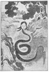
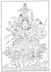
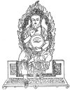
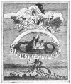
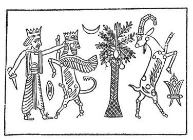

  
[Intangible Textual Heritage](../../index.md)  [Sacred
Sexuality](../index)  [Index](index)  [Previous](tsf06)  [Next](tsf08.md) 

------------------------------------------------------------------------

[Buy this Book at
Amazon.com](https://www.amazon.com/exec/obidos/ASIN/0806504560/internetsacredte.md)

------------------------------------------------------------------------

*The Sacred Fire*, by B.Z. Goldberg, \[1930\], at Intangible Textual
Heritage

------------------------------------------------------------------------

p. 96

### CHAPTER V

### LOVE'S HIDDEN WAYS

<table data-border="0">
<colgroup>
<col style="width: 100%" />
</colgroup>
<tbody>
<tr class="odd">
<td data-valign="top">
<em>Beyond light and shade, 
Beyond thing and thought, 
There is love forever lurking</em>.
</td>
</tr>
</tbody>
</table>

#### I

ON the cross-roads of the Balkans, near a city called Naissus, an
illegitimate son was born to an innkeeper's daughter. The boy's arrival
in the world hardly raised a stir at the very inn of his mother. Yet he
came to rule over a mighty empire and to shape the destiny of Europe. As
if to reflect upon his parents, this boy was named Constantine.

Up from obscurity Constantine climbed. He fought his burdensome way
through Roman soldiery in the East. On the banks of the Danube his star
began to rise. He was made a tribune. He became a Cæsar. He made himself
an Augustus. Slowly, slowly it all came about. It required patience to
wait until a superior would rise to greater heights and vacate his
place. Prudence was necessary that neither envy nor suspicion be aroused
in filling the place vacated. And courage was needed when the ripe
moment came to make the move so decisively that it would weather any
storm.

Patience, prudence, decision, brought this son of a woman innkeeper of
Naissus to the very waters of the Tiber—at

p. 97

the head of an army. But there was the end. Across the bridge lay Rome
with Maxentius and his army, two hundred thousand strong. Beyond Ponte
Molle no one could go. Constantine saw Severus try it with disastrous
result—Severus, the very man in whose footsteps he had followed on his
climb in the East. He watched Galerius make his attempt to cross the
Ponte, Galerius whose star had sailed out of the East westward across
the heavens—the celestial path his own star followed. Galerius never
came to Rome again. The hopes and aspirations, the very lives of these
Augusti lie buried in the sands of the Tiber shore.

It was just like Constantine to halt at Ponte Molle and—wait. But one
day, Constantine had a dream—a dream at noon-time. On the horizon in
front of him he saw a flaming cross; the familiar triad, which the poor,
persecuted men and women called Christians always carried about them. In
the flame of the burning cross he read: "*In hoc signo vincas*"—in this
sign you will conquer.

When he came to himself, his patience was gone; his prudence thrown to
the wind; only decision was left, his decision to cross the bridge,
however unequal his army might be to the forces of Maxentius.

So Constantine had a cross made and bearing the sacred emblem he passed
over the Tiber and took Rome. And the son of a woman innkeeper at
Naissus sat upon the throne of the Cæsars with the name Constantine
carved upon it. When he left this throne, heeding the call from a still
higher one, fame came and added "the Great" to his name.

Constantine was the first Christian Emperor, the founder of the Holy
Roman Empire, and the father of papal power at Saint Peter's. Who knows
what might have become of

p. 98

the growing yet already disintegrating band of Christians had not
Constantine joined them at this time? The faith of the cross had been
saved by the vision of the cross appearing to a mighty man of Rome.

True, Constantine was just then in need of a faith. He was facing the
crucial point of his career, the critical moment of his life. And
everything was against his favor. Considering the actual situation,
common sense would have made the ardent leader stop at Ponte Molle. All
his courage and energy, fired by ambition and his overwhelming desire
for power, could never have carried him across the bridge in the face of
such odds. Yet, there was one source out of which a hand might appear to
lead him. There was still something that could save him. It was faith;
the force that takes away the very sense of reality and taps the energy
of the subconscious, the mystic nature in man. Faith—the power that
makes so many super-human heroes, men who defy nature and life itself to
attain their goal.

Faith, a new faith, Constantine needed, to make his own cause the cause
of the faith, so that he might fight his own battle in the name of God
and for his religion. "When thou goest forth to battle . . . thou shalt
call in the name of God. . . ." Constantine may have saved Christianity,
but Christianity surely saved Constantine.

Now, he may have heard long before of those poor, ridiculed bands of men
and women who called themselves Christi ins. He may even have been
acquainted with the ideas and rituals of this new group coming out of
the East. Yet no amount of knowledge or rational persuasion concerning
Christianity could have given him that reliance and self-confidence
needed to cross the bridge. Mere

p. 99

thought, abstract idea, imageless belief, never carried one off his
feet. The Sermon on the Mount might or might not have aroused
Constantine's admiration; the vision of the fiery cross conquered worlds
for him. The symbol of Christianity was more effective than Christianity
itself.

A symbol will rouse men and women and carry them over all sorts of
obstacles, beyond their apparent limitations. A striking example of its
efficacy is to be found in the mascot. Everyone undertaking a hazardous
task "trusts to luck." He has no solid reason for believing that things
will take a good turn in his enterprise; but he hopes for it. It is the
will to win that instills the hope of victory and inspires confidence in
the ability of the individual to carry the project to a successful end.
So far, it is all abstract and cannot very well hang together. What is
lacking is a concrete basis for this sentiment of trust and confidence,
and belief in luck. This is offered by the mascot. The elk, or dog, or
rabbit, taken along on a dangerous voyage, on an airflight, or to a
football game is supposed to assure the luck that is hoped for. And any
man may commit this intellectual sin and accept the superstitious
premise, not because he believes in the mascot's power to charm, but
because it offers an object upon which he can collect and focus all his
hope and confidence.

Deep in the heart of every man there is a strong feeling of nationality,
but whether his nation be large or small, as an abstract thing, it is
hard for him to visualize it and to love it in itself. There is a
symbol, however, that offers him something upon which to center his
devotion. It is the flag, the emblem of the land he loves and honors.
His entire thought may be taken up with the problems and

p. 100

duties of business and life; he may have little time to think about his
country. But once an appeal is made to him in the name of his flag, he
will drop everything for it. It exerts such a hold upon him that he may
gladly face death itself to protect it.

The cross and the crescent, the emblems of two great religions, convey
to their followers thoughts that transcend the limitations of language.
And the faithful, in turn, love these symbols of creeds that are in
themselves highly abstract. The very cross that means so much to a
Christian

   
The Persian Triad

may convey an entirely different idea to a man of another belief. In the
times of the Inquisition, to save his life, a Jew might bend before his
executioner and kiss his boots imploring surcease from torture. Yet, he
would not kneel or touch the cross with his lips. The former was simple
humiliation; the latter was to him a symbol of betrayal of God and
people.

In religion, symbols play an important rôle. The symbolic object offers
many sensations, every one of which helps to keep the idea that is
symbolized in the foreground of consciousness. A symbol is the hold that
a man can

p. 101

obtain on an abstract thought, the peg upon which he can hang his heart,
the funnel through which he pours out his soul.

#### II

If it is difficult for us today to grasp a purely abstract idea, how
much more difficult must it have been for the man of primitive times?
His mind was less organized, his notions more confused, and his thinking
heavily befuddled. Watch a steamer sail out of a haze on a misty morning
and you will see man's thinking slowly emerging out of primitive
mentality. Watch the steamer making shore on a foggy night and you will
observe the primitive mind groping for a way to give a meaning to the
multitude of impressions hammering away at him from all corners.

Imagine Old Anthropology Adam struggling toward the concept of a
generative force in nature. Its manifestations showered upon him at
every turn: spring, warm weather, green grass, flowering fields, budding
trees, fresh products of the land, births of animals, the increase of
fish in the streams. There were births in his own hut and there were
times when he himself seemed reborn as well. He felt the sharp, sweep
pang of romance, and his whole being was attuned to mystic forces beyond
his power of comprehension. What a leap from all these varied
impressions to a single thought of regeneration!

Thrown amidst these phenomena of life, death, and rebirth, primitive man
was unconsciously groping in the dark of his ignorance, seeking a
symbol, a unifying element for all that was going on about him. Lost in
the woods, he was searching a way out into the open. In the language of
today, he was attempting to give a meaning in a single concrete form to
the various phenomena of generation

p. 102

about him. This process was gradually and unconsciously working out in
the primitive mind, clarifying his thought and giving it definite
expression, just as our ideas become definite and fixed in our minds
very often while we are apparently not thinking at all.

One such clarification was light. In the dark, all things seemed to ebb
away. All nature seemed to have sunk into a languid inactivity, while
man himself was lost in sleep. Whatever lay awake at night was a source
of danger and of fear. Darkness was an enemy. Darkness was death.

As the sun creeps above the horizon a new day is born. Everything begins
to stir: the birds chirp and the horses neigh. When the sun rises, man
may leave the dark, damp cave and bask in sunshine. He feels as if new
life has come to him. As the days grow longer and the rays of the sun
become more intense, all nature seems happier, the fields yielding their
crops and the trees their ripening fruit. Consequently, this heavenly
body may be that common denominator in all manifestations of generation,
so gropingly sought after by primitive man. Just as the father is both
generator and provider of the family, so may the sun be generator and
provider of all life upon the earth.

To the sun, the author of life, the power behind all generation,
primitive men sought to render homage by identifying him with the
principle of good. They personified the sun in such divinities as Brahma
of the Hindus, Mithra of the Persians, Osiris of the Egyptians, and
Adonis of the Greeks. We, therefore, have sun worship all over the
world, in some places in its pure form, in others in a form merged with
other symbols.

Some superstitions prevailing until very recent times point to the
erotic element of the sun. It was believed that

p. 103

if a young woman walked naked through a field of corn in the intense
sunlight of midday, she would become pregnant. In the same way, some
Slavs still hold the belief that a woman may conceive by standing naked
in the moonlight; the moon like the sun being once taken for a deity.

Again, it may not be the sun itself that is behind creation, but the
light of the sun, its rays, the fiery ball sinking below the edge of the
world at the approach of night. That is fire, the great mystery that
consumes everything like the crocodile, yet aids man in combating
darkness and in driving off the beast. The fire built by man is only a
small part of the great fire of the Universe that makes for life and
generation. Just as it sustains life, it may also generate it. And just
as it generates, so does it consume, transforming everything it touches
into ashes and smoke. Fire is the beginning and the end of things. It is
the basis of all the generative manifestations that the spiritual hand
of primitive man was groping for. Its worship became another universal
religion.

Fire and sun came to serve man as symbols of the generative force; but
even they were abstract. The sun is distant and cannot be touched. One
cannot even look at it when it is at its zenith. It is difficult to
visualize its action upon the earth, or to see in the concrete its
generative quality. Fire, too, is intangible. The young child tries to
grasp the flame before him. He reaches for it, but it only burns his
fingers. Fire is something that is nothing. God appeared to Moses in the
form of a fire upon the bush. Yet Moses could not tell what God was, and
when he asked, the answer came: "I am that I am," a very slightly
illuminating reply. Had God appeared in the form of a bull,

p. 104

like the god of the Egyptians, Moses would not have been puzzled.

In consequence, both of these representatives of the generative
manifestations had to be reinforced with more concrete symbolic aids.
There were animals about man doing in their own way for themselves what
the sun or fire was doing for the universe. There were the bull and the
goat, both of which came to their high positions in the religions of the
world because of their supposed superior virility. They performed
sexually oftener than other animals in primitive man's immediate
environment. And in the period of rut no other domesticated animal could
compare with them in sheer brutal strength and in the blind urge that
would not stop at self-destruction in its hunt for the female. The
strength of the force of rut fills us with awe even today. The sight of
an aroused bull making for the cow or of a stallion rushing upon the
mare is an exhibit of so tremendous an urge that it cannot fail to
impress.

The generative force exemplified by these animals introduced the animal
symbols as aids to the higher symbolism of the sun and fire. In time,
these symbols, just because they were more concrete, overran the entire
worship. There are religions in which the bull or goat or serpent is the
basic element and the sun or fire has almost entirely vanished from the
minds of the worshippers, lingering only in rare and half-forgotten
rituals.

When the Bijagos of Africa were attempting to represent in the concrete
their generative deity, they took the goat as its representative on
earth. Similarly, the old Aryans of Europe had their spirits of the
woods, Ljeschie, depicted with the horns, ears, and legs of a goat. The

p. 105

woods were ever swarming with life: grass and trees, birds and beasts
and insects. There was always something creeping, flying, humming in the
woods. This seething life, this bubbling-over of the forests, must be
the spirits of life, Ljeschie. And only the goat could justly symbolize
the generative powers of the divinity.

Dionysos, the Greek and Roman version of the Eastern god of generation,
was personified as a goat. This god was born, died, and came to life
again to annually resurrect all nature, just as he himself had been
resurrected. He was known as the "one of the Black Goatskin."

The sacred goats were usually kept in the temple with considerable care
and tenderness. At Mendes, there were sacred stalls for them back of the
room containing the altar. As the ceremonial progressed and the
worshippers worked themselves to a pitch of excitement bordering on
ecstasy, the goats were let loose among them. There was a scramble to
touch the sacred animals. People struggled with one another for the
opportunity to give them an humble kiss of homage. In this state of
excitation, amidst song and revelry, attempts were made to join in
sexual union with these living symbols of virility. There were he-goats
for the woman worshippers and she-goats for the males. Those who were
not fortunate enough to have the animal impersonations of the generative
divinities had to be satisfied with human substitutes. And general
sexual promiscuity followed the festivities and worship.

Not always, however, was the life of the sacred goat so happy. Often
enough this animal became all the more sacred in its death and was
offered up as a sacrifice to the generative god. Just as man offered his
own generative organs, or parts of these organs, to the divinities, so
did he

p. 106

sacrifice the entire animal that symbolized for him the very essence of
these organs.

Kali was an Indian goddess, who knew everything that was going to happen
to the humans in the huts and villages of India. She was kind enough to
impart her knowledge in the form of prophecy to the priests in her
temple. Yet she would not descend to her earthly dwelling-place unless a
goat was sacrificed upon her altar and her priests sucked the blood of
the animal while it was streaming from its cut neck.

The fate of the bull in the faith of the primitive peoples was not much
different from that of the goat. There were occasions when the bull was
eaten alive so that the worshippers might draw directly to themselves a
part of his living force, for this animal was a powerful phallic emblem
signifying the male creative power. At the Dionysian mysteries, bulls
were torn apart and their flesh devoured while still warm. Dionysos
himself was often represented as a bull as well as a goat. In Achia, the
priests of the goddess of the earth could not commune with the divinity
before they had offered her the fresh blood of a bull.

However, there were places where the bull was kept with great care, led
a long life of comfort and ease, and, at death, received a distinguished
tomb. There was the sacred bull of Egypt. In excavations at Serapeum,
near Memphis, in Egypt, the tombs of over sixty of these sacred animals
have been discovered. In these tombs, one usually finds a careful
statement of the age of the animal, its place of birth, its mother's
name, and the date when it was enthroned. Even the plain bull, without
any official connection with god or temple, was held in great esteem.
All these animals that died a natural death were carefully

p. 107

buried in the suburbs of the city, and their bones were afterwards
collected from all parts of Egypt to be interred in a single spot. When
the bull lost his life in religious duty, such as in sacrifice to Apis,
all the worshippers beat their hearts and mourned his death.

The worship of the bull was not confined to Egypt and Greece. In India,
Nandi—the sacred white bull of Siva—

[  
Click to enlarge](img/10700.jpg.md)  
The Serpent the Sacred Image of the Solo-Phallic Cult  

is still the object of much veneration. For the Persians and the Jews
this animal, the personification of virility, served as an important
religious symbol. And it was reverenced as well by the Assyrians, the
Phœnicians, and the Chaldeans.

Like the bull and the goat, the serpent came to lend its aid in
presenting to the human mind the force of generation

p. 108

in the world. Because it annually sheds its skin, reappearing in a new
body as it were, this animal has for ages been looked upon as the emblem
of immortality and reincarnation. The serpent, it is said in the Bible,
is "more subtle than any of the beasts in the field" and therefore
carries away the biggest prize. Not only has it become an erotic symbol,
but it was, at one time, almost a universal religion in itself.

The American Indians had their serpent mounds, and the Druids reverenced
their sacred snakes. The mystic serpent of Orpheus, the Midgard snake of
Scandinavia, and the brazen serpent of the Jews give testimony to the
universality of this religion. There are even today some quarter of a
million snake worshippers in India alone. A carved serpent curled up in
an oval may still be found among the decorations on the ark in the
synagogue. There were serpent ceremonies in Europe long after the advent
of Christianity. Within recent times, live serpents were burned on the
Eve of Saint John in the Pyrenees. The Ophites caused a tame serpent to
coil round the sacramental bread and worshipped it as the representation
of the Savior. The very traditions of Saint Patrick driving the snakes
out of Ireland and of the expulsion of serpents from France indicate the
struggle of early Christianity against the worship of the
serpent-lingam.

What is it that singled out the serpent of all the animals for such a
prominent place in the symbolism of religion?

On the one hand, it was the particular impression the serpent was making
on the primitive mind. Its noiseless walk aroused both suspicion and
mystery. Its peculiar gaze and its knowing look, along with its supposed
power of fascination, won the serpent the designation of "intelligent

p. 109

fish" from time immemorial. Its name in some languages means life; it
also stands for wisdom. It was the serpent that opened the eyes of the
first human pair that were born blind. The serpent is the teacher of man
in wisdom, but its wisdom is generally taken to be misguided and applied
for evil purposes. It was evil in the minds of some primitive peoples;
it is evil in the faith of Zoroaster; it was so conceived in the
Biblical story of Adam and Eve.

   
Serpent worship in early Christian art

In Sunday school, we learn of the serpent in his glory. He did not crawl
over the surface of the earth but had legs to stand upon. In fact, he
walked erect like Adam and Eve and was equal in height to the camel. He
could talk and was in the habit of conversing with the first woman on
earth. He was clever enough to meddle in the life of the first humans
and to offer them the benefit of his counsel.

To be sure, it was bad advice; slyly he induced Eve to desire the fruit
of the forbidden tree. Gently and cleverly

p. 110

he pointed the way to disobedience of the divine command. And as the
woman slid downward, she pulled man down with her. It was by the guile
of the serpent that Adam and Eve were driven out of the Garden of Eden
to a life of toil and pain. Like Samson of a later day, the serpent
itself shared the ruination it caused. By the fall of man, it was
crushed and left to spend its days crawling upon the earth.

There is more to the story than is told to the Sunday school class. The
serpent was in love with Eve. He had seen Adam and Eve in their conjugal
act and was animated by a passion for the woman. He hoped to get Adam
out of the way and to take Eve for himself. The serpent is the first
illicit desire of sex, the first thwarted passion of love, the first
struggle of the male with the male for the female.

There is another reason for the serpent's place in religious
symbolism—its resemblance to the lingam. They who ascribed the life
principle to their own organs of generation were impressed by a living
animal so suggestive of the male generative organ. So they deified the
serpent and associated it with the sun-father gods and the generative
divinities in general.

Like all male gods, the serpent came to be considered as a source of
generation. A married woman needed only to enter a place where
Tamburbrin, the eel-like creature was, and she would become pregnant. In
the temple, a serpent might assume a human form and bless the woman
worshipper with his divine sexual presence. The offspring resulting from
this union were known as the children of the snake. In the execution of
the sexual function, however, the priest represented the serpent.

Just as we today associate the generative powers with

p. 111

youthfulness, so did the primitive men ascribe to the serpent not only
generativeness, but the capacity of eternal youth as well. Utnapishtim,
living beyond the mountain Mashu, past the wonderful park and across the
Waters of Death, knew the secret of immortal life and perpetual youth.
Gilgamesh, a hero of Elam, who became a god in Babylonia, set out to
learn this secret. After a series of supreme difficulties, he ran the
gauntlet of scorpion men and obtained the thing he so desired. But a
serpent in the pool deprived him of the plant that rejuvenated old age,
and itself became the guardian of the treasure. Out of scorpions the
secret came to Gilgamesh; to a serpent it returned. The serpent is in
itself the fountain of youth.

Once this animal symbolizes virility and youth, it is promptly exploited
by men anxious to impregnate women. At a religious festival in Bengal,
the men march entwined with snakes, while the chief has a rah-boa, or
python, round his neck. It is a march like many others in which the
males strut out like birds before the females, in display of their
conjugal strength. He who kills a serpent even accidentally may be
burned alive, for he has exposed the virility symbol to humiliation and
insulted the men of the tribe.

Naturally, it was the women who were to show the greatest reverence to
the serpent. It was their homage to the lingam, the sign of their
subjection to the male sex. In India, there are wives of the snake as
there are wives of the other gods in the temples. In Malabar, the
serpent inspires certain women with oracular power, if they are perfect
in their purity. In another place, the oldest woman enjoys the
distinction of carrying the image of the serpent in the processions.
This woman must lead a celibate

p. 112

life, since she is dedicated to the snake. Like many generative
divinities, the serpent is worshipped by women with libations of milk;
they are bestowing upon the snake their motherly gift.

If the serpent is a god and a source of fertility, it is only natural
that he should be looked upon as a father as well. And a father he is
for many of his worshippers. The rattlesnake men of Moqui claim to have
originated from the snake, and snakes they will become after death. The
Black-snake men of the Warramungas believe that they embody the spirits
of snakes, which their ancestors, genuine serpents, deposited in a
certain creek. The Moquis of America claim descent from a woman, who
gave birth to snakes; in consequence, reptiles are freely handled in
their snake dances, the purpose of which is to secure fertility of the
soil.

In Papua, the natives have given thought to the animating principle of
human beings. What is that something that gives life to a growth within
the woman's body and causes it to eventually emerge as the new born?
Why, it is Birumbir, of course. Birumbir is the embryo, as we might call
it, operating within the uterus. And how does Birumbir get there? It
enters the vulva in the form of Junga, and the Junga is inserted by an
eel-serpent-like creature called Trombuir. Translated into our
scientific tongue, it is as if we said: life is brought into the womb in
the form of semen introduced by the male organ. In the picturesque
language of the Papuans, the lingam is the serpent-like Trombuir.

Now while Trombuir may enter the yoni of a married woman and impregnate
her, it cannot do so to virgins. In the latter, the entrance is closed.
Some special ritual

p. 113

must be observed by the woman and the tribe before the serpent or lingam
may find its way to her. This is the

[  
Click to enlarge](img/11300.jpg.md)  
A Serpent god  
(An old Chinese print)  

origin, perhaps, of the universal stories of serpents guarding a
treasure or dragons watching over hoards of value. It is

p. 114

symbolic of the masculine desire held in abeyance before the taboo on
the virgin is raised. Having appeared on the scene as the mere physical
representation of the lingam, a sort of living pillar, the serpent by
its own attributes grew to much larger proportions and took on deeper
meaning. It came to signify both wisdom and virility and to express the
male protest and the masculine anticipation at the gate of the eternal
feminine.

#### III

It should not surprise us at all that just as animals came to reinforce
generative symbolism on account of their virility, man's own virility
should also come in as an additional element in the symbolism of
generation. Primitive man was greatly occupied with his own organs of
reproduction. He offered them in sacrifice to his gods; he operated upon
them for his own salvation; he was ever conscious of their virility. No
wonder, then, that they became for him the symbols of generation in the
universe. Just as the sun was the father, so was man's lingam the
father, and just as the moon was the mother, so was the yoni. Not only
were these organs themselves symbolic, but anything suggesting them
became emblems of the generative divinities. The lingam is in the shape
of a rod with a round head; so any object of this form, stone or wood,
might become such a symbol. The yoni is an oval opening; so any oval
figure might represent the female divinity of sex. By further
simplification it was enough to draw a vertical line to suggest the
lingam and a horizontal one to signify the yoni, while the union of the
two was represented by the cross.

p. 115

The erotic symbol in religion was naturally a concomitant of the erotic
religious thought. In fact, the two were elements of the same formative
process. The thought affected the symbol, and the symbol influenced the
idea. We should, therefore, expect the development of erotic symbolism
to follow that of erotic thought. Just as man originally saw the
generative process not by sexes but in the actual union, so did he seek
to symbolize the generative force by the actual union of the sex organs.
We find such images in Africa and Australia. We come across them in
India and Japan. We can observe them carried in procession to the temple
of Persephone. There are collections of such amulets in some museums
with the notice that they were in use as late as the seventeenth century
in Southern France and Italy.

Upon the altar of the Hindu temple, there is a sacred object of deep
meaning. It is what the cross is to the Christian and the tablets or
scroll to the Jew, and more. It is a cylinder hanging from a vase which
is set into a pedestal. The pedestal is symbolic of Brahma, the basis of
all that is in the universe, the fundamentals of reality. The vase
stands for Vishnu, the goddess, the female principle; and within it is
the cylinder, representing Siva, the male god, the lingam. Highly
involved as the Hindu trinity is, its symbolism is simple. Here we can
see the foundation upon which the Hindu mythology has developed. It is
the representation of the sexual organs in union.

Close to three millenniums before the Christian era, a Chinese emperor,
Fu-Hsi, was given to creating religious symbols. He invented the pa-kua,
eight symbols consisting of broken and unbroken lines; the broken lines
were

p. 116

[  
Click to enlarge](img/11600.jpg.md)  
Kwan-yin, the Oriental Queen of Heaven  

p. 117

symbolic of the yoni, while the unbroken ones represented the lingam.
Here again we have the two sexual principles together.

In the mythology of both Japan and China, there is the Queen of Heaven,
Kwan-yin, whose name means: yoni of yonies. She is represented as seated
upon a lotus, which, in turn, is a symbol of the womb, and immediately
over her is her lord, Shang-ti. Below the two of them the emblem of
fertility is placed. This same queen of Heaven and lady of plenty,
Kwan-yin, is sometimes represented as a fish goddess. Then she is shown
holding a lingam and swimming in a phallic sea.

Seeing the generative process in the union of the sex organs, primitive
man came to conceive of it as essentially hermaphroditic in nature. And
so the scarab, because it was believed to be double-sexed and capable of
fructifying itself, became a sacred emblem. It was symbolic of the
generative force in nature. In Egypt, it was the emblem of Khefera, god
of creation, father of gods and men, creator of all things and the
rising sun. In times of famine and poverty in medieval Europe, the
people resorted to an old symbolic service to secure divine aid. In some
places, the "need-fire" was kindled by two naked men, who rubbed two dry
sticks together, an action in itself symbolic of the sexual process.
With the flame they lighted two fires between which the cattle were
driven to insure fertility in the herd. In other places the monks
kindled the fire in the presence of the faithful. Near the fire they
raised the image of the lingam.

The ceremony was a form of magic. It was an appeal to the heavenly
powers to engage in the process of fertility and bring an abundance of
crop. The fertility powers in

p. 118

nature were definitely shown what was expected of them by the kindling
of the "need-fire"; it was a symbolic union of the sexes. The sexual
union, then, was the purpose of the ceremony. Still, at its end an image
of the lingam was raised. Of the two sexes represented in union, one
emerged separated, individual, with a place for itself in the ceremony.
It was the development of the god of sex, male in this particular case,
from the divinities representing the sexual process. Religious
symbolism, therefore, had to seek ways of representing the individual
agents of sex—heretofore represented together.

Of the two agents of the sexual process, it was only natural that the
female principle should first occupy the primitive mind. The female is
directly associated with the birth of new life. It is the mother who
brings the child into the world and it is she, too, who nurses the
young. In sexual symbolism we might, therefore, expect the female
principle to be most often represented. As a matter of fact, however,
there are comparatively few female symbols, while there is an enormous
number emblematic of the male organ. The reason for this is often given
as the difficulty in representing the female generative organ; the male
organ, on the other hand, invites representation. However, this is
insufficient reason. The symbol did not always represent the organ
realistically. It was often only suggestive. If no difficulty was
encountered in representing the lingam by a straight line, there is no
reason why it should not be possible to represent the yoni by curved
lines or an oval. There were many ways of suggesting the yoni that
called for little effort or technique.

The real cause for the paucity of female symbols must be sought not in
the technical process of representation but

p. 119

in the ideals motivating the social group. In a social system dominated
by males, where the women are held in subjection, it is small flattery
for the males to have the feminine principle worshipped in the temples.
Man, dominating the social group, could not declare himself divine, but
he could attribute a divine significance to the lingam. When masculinity
is worshipped, the male naturally assumes greater importance.
Consequently, the male principle was all the more dominant in countries
where women were held in subjection. As the women were more and more
enslaved, especially in the western world, the religious symbolism grew
more masculine. Man forced woman not only to serve him but to worship
his virility as well.

#### IV

The female principle began its symbolic history crudely enough. Centered
upon the mother idea, it only sought to represent motherhood. Just as
there was an individual mother giving birth to individualized life, so
was there a universal mother giving birth to new life universally. The
universal mother was represented by the individual mother. Such a mother
was Oma-Oma of the Hindus. She was a goddess, yet greater than all gods;
for she was before gods came into existence and before existence itself.
In many early religions the mother goddess was the supreme deity, the
male gods playing only a secondary part.

The individual mother was represented by the figure of a woman with her
breasts and genitals greatly exaggerated, or even by the images of these
parts alone. There were female breasts and genitals upon the supporting
columns of almost every temple in antiquity. Similar carvings were found
over the doorways of the Christian cathedrals in

p. 120

\[paragraph continues\] Ireland, where
they served as a protection against evil. In the Cossit library of
Memphis, Tennessee, there is a Mexican idol in the form of a woman with
her yoni fully

[  
Click to enlarge](img/12000.jpg.md)  
Maya, the Hindu goddess, forcing from her breasts the nourishment of all
creation  

exposed ready to receive the lingam. There is a goddess on the Slave
Coast in the form of a pregnant woman, who is invoked against
barrenness. Another African goddess, Odudua, is represented as a seated
mother holding her child, and the walls of her temple bear carvings of
the lingam and yoni. There are goddesses imaged with babies

p. 121

growing out of their fingers, toes, and all parts of their bodies, and
goddesses possessed of many breasts, like the many-breasted Artemis. Out
of this idea of motherhood, grew the mother-child symbolism that was so
common in the art of ancient times and that later developed into the
beautiful Madonna paintings of Christian Europe.

As the idea of mother dissolved into the more generic idea of
femininity, the artist jumped a step. He no longer sought to represent
the mother or female herself, but to draw or sculp an object that would
suggest the female figure or genital. What was it that made the artist
give up realism for impressionistic symbolism? It may have been a
growing sense of refinement which makes us speak, at times, by
indirection or use sarcasm where we might scold and abuse. Again, it may
have been the helplessness of the artist in presenting a realistic
picture, or his sheer laziness.

Crude draftsman that primitive man was, he may have found it difficult
to carve the vulva in true detail. Often, all he succeeded in doing was
to hammer out a figure in the form of a horseshoe, the very figure that
is nailed to so many doors in various parts of the world, as an emblem
of luck. Mighty few of those who live in such houses know that the
horseshoe is only symbolic of the yoni and that by nailing it to their
doors, they follow out a custom older than the history of their race.
Another female symbol of this kind is the Greek delta or the Hebrew
dalet, a pointed triangle in form, which also means door.

Another attempt to re-create the yoni was the pointed oval. We may find
it yet over the portals of ancient temples in Yucatan and we can come
across it anywhere

p. 122

in India. A profile view of the yoni would suggest the crescent, the
sacred emblem of the Moslem, the symbol of Selene, the moon-goddess who
appears in similar form in the sky. Selene stood for lunar periods
associated with the periodicity of women.

Any oval or fissure may represent the female generative

[  
Click to enlarge](img/12200.jpg.md)  
An Oriental divinity  

organ. There were oval stones with a cut in them to which women came to
pray and to find solace. The *asherah* so often mentioned in the Bible
was originally an accidental stump of a tree and later the trunk of a
tree with its branches purposely cut away. It had an opening or a
fissure, called the Door of Life. Around this door, there were thirteen
tufts of hair representing the thirteen

p. 123

periods of a woman in a year. Above it, there was an emblematic
representation of the clitoris.

The filled oval suggests the egg, which itself has generative powers.
The oval-egg shape admits a number of objects into the female symbolism
of religion. Among these, we find the peach in China and Japan.

There is still another line of female religious symbols—symbols that
came to be what they were because of their resemblance to the female
organ, not in appearance, but in function or activity. Just as the
mother harbors the new life, so might any object housing things be
symbolic of the mother. The ark, for instance, is a female symbol. The
story of Noah's ark is really the story of a dream fulfilled, the dream
of returning to the mother to escape from a disappointing reality into
the protecting womb of motherhood. The ark was the container of the
Tablets of the Covenant of Moses, the Book of the Law, and other sacred
objects of the Hebrews. A tabernacle is also a container like the ark,
and in the Roman church Mary is called the tabernacle of God. Mounds and
pyramids came to be symbols of the female principle, and taking a dead
pharaoh to his tomb upon his demise was actually returning him unto the
universal mother whence he came into the world.

By a similar analogy, woman came to be symbolized as a bridge between
god and man. Like Prometheus, she steals life from above and brings it
forth upon the earth. She is the intermediary between the divine and
human, and as such, she is symbolized by objects suggestive of a bridge
or crossing. One of these is the altar, which, in India, is called
"yoni."

Similarly, the apricot, bean, barley, vesica piscis, comb,

p. 124

cave, and various other things developed as suggestions or symbols of
female organs of generation, just as did the circle and the ring. The
part of the latter in our marriage ceremony is clear enough, although
few people give it a thought. The act of putting on the ring is only the
reverse of the function of the consummated marriage. It

   
The Sheela-na-gig found on ancient Irish churches

would thus be more appropriate if the groom put his finger through the
ring held by the bride. Whatever it was that reversed the process, the
reversal brought an additional meaning to the ceremony: it were as if
until the wedding, the ring, or yoni, of the bride was not recognized
because it was not functioning. By giving the maiden the ring, the groom
calls upon her for the functioning of the yoni.

p. 125

#### V

If there are many symbols for the female principle, those that represent
the male force are countless, indeed. The first attempt to represent the
latter was a man with a lingam greatly enlarged, or the lingam itself,
of enormous size, detached from the body. We have already taken note of
such figures in African temples. In the religious festivals of Egypt,
the image of Osiris was carried in the processions. This figure was one
cubit in height and the length of its lingam was also one cubit. The
women of Rome reverenced waxen reproductions of Priapus with the lingam
enormously disproportionate and movable at will. When the Protestants
took Embrun in 1585, they found there the image of Saint Foutin with an
exaggerated lingam which was reddened by the libations of wine that had
been poured over it by women needing its aid.

Not only were such phallic figures to be found over gateways and
doorways of churches and public houses, but the image of the lingam
itself, detached from the human organism, is frequently met with. There
were such figures at the entrances to the houses of worship among
primitive men. In the largest and richest temple of Syria, at Acropolis,
there were two immense figures with the inscription: "Bacchus has
brought these phalli for Yunon, his mother-in-law." The lingam detached
was known in Latin as Mutinus, Tutinus, and later as Priapus. In the
convenient form of an amulet, it was called Fascinus.

A red lingam was often the sign above the door of legalized houses of
prostitution. Both the Greeks and the Romans used to place an image of
this organ upon their

p. 126

graves. It was an affirmation of the belief in eternal life in the very
face of death. Was not Priapus referred to as "savior of the world"? At
Trani, in Italy, a lingam was carried through the streets in religious
processions. It was called *il santo membro*. Idols representing it were
so common in Christian times that there was a special penance for
performing incantations to the lingam. Hot cross buns were originally
phallic in form—a reproduction in dough of the generative organs.
Finding it impossible to break the people away from this custom, the
early Christian fathers ordained that these buns be marked with a cross
and accepted in Christendom.

In antiquity, the woman received an amulet from her husband on their
wedding day, and she was supposed to wear it round her neck. It was a
bejewelled lingam bearing the inscription: "When they join." Phallic
amulets were particularly common in Naples, where they were worked into
the designs of vases, rings, medals, and even precious stones. A lingam
amulet was often nailed to a tree for the protection of the countryside.
In France, a *fesne* was a lingam amulet said to work magic. In Japan
today, the young man gives an amulet to his beloved. It is a box
containing a realistic representation of the lingam in ivory or metal.
When a corner of the box is pressed, it opens and the lingam emerges by
means of a delicate spring. In Isernia, full-sized reproductions of the
lingam were offered to the memory of the saints, Cosmos and Damian; and
this very day, in Naples, one may buy such an image with a serpent
curled about it. Sir Joseph Bank, writing in 1786, describes some of the
phallic amulets he observed in the same city:

"On the 27th of September at Gernia . . an annual fair \[126\]

p. 127

was held which lasted three days. The situation of this fair is on
rising ground, between two rivers, about half a mile from the town of
Gernia. In the most elevated part there is an ancient church with a
vestibule . . . This church is dedicated to Saints Cosmo and Damiano. On
one of the days of the fair, the relics of the saints are exposed and
afterwards carried in procession from the Cathedral of the city to this
church, attended by a prodigious concourse of people. In the city and at
the fair, exvoti of wax, representing the male parts of generation, of
various dimensions, some even of the length of a palm, are publicly
offered for sale.

"There are also waxen vows that represent other parts of the body mixed
with them, but of those there are few in comparison with the number of
Priapi. The devout distributors of these vows carry a basket of them in
one hand and hold a plate in the other to receive the money, crying
aloud: 'Saint Cosmo and Saint Damiano.'

"If you ask the price of one, the answer is 'piu ci metti, piu
merito'—the more you give, the more the merit. The price of a man is
fifteen Neapolitan grains and of a litany five grains. The vows are
chiefly presented by the female sex; they seldom are such as present
legs, arms and the like, but most commonly the male organs of generation
. . . At the time, a woman presented a figure of the male organ of
generation in that state of tension and rigidity which it assumes when
about to discharge its functions, she said: 'Santo Cosmo benedette, cosi
voglio.' Blessed Saint Cosmo, let it be like this.

"The vow is never presented without being accompanied by a piece of
money, and is always kissed by the devotee at the moment of
presentation."

p. 128

Leaving the field of complete realistic reproduction of the male
principle and entering upon its symbolic representation, we find that
anything suggestive of the lingam may become a symbol. There is the
pestle, for instance, still generally considered as the male in
distinction to the mortar which is the female. In olden times, these
objects played a greater part in the daily' life of the people and their
sexual meaning was consciously accepted as such. There is the mushroom
with its bell-like, enlarged prepuce. There were the pillar and the post
universally considered as sacred not to any particular divinity, but to
all the gods.

Moses operated with a rod when he was vying with the servants of Pharaoh
in magic power. Some of us still pay for the services of a "divining
rod," which is said to locate water or mineral veins. There is the
concept of the "staff of life" in modern mysticism just as the Tree of
Life figures mystically in the story of Adam and Eve. There is a forked
stick used in mystic ceremonies and perhaps there is something of this
rod-lingam meaning in our custom of carrying a cane. Possibly that is
why the cane is more of a man's companion in a love escapade than it is
an aid in walking.

In Japan, the term *wo-bashira*, or male pillar, is applied to the
railing of a bridge or a balustrade of a staircase, and to the end of
the tooth of a comb, since they all in some way suggest the lingam. Our
own Maypole comes down from post and pillar worship, associated with May
festivities—the spring fertility celebrations of ancient times. The
custom of distributing prizes from the Maypole is suggestive of its
fruit-giving or gift-bringing powers. At the same ceremony, the
gathering of the seed of the male

p. 129

fern further points to a connection between the Maypole and the sexual
life.

Along with the rod belong the bow and arrow which are likewise lingam
symbols. Above the Assyrian grove,

   
An early Priapic statue

there was a winged figure, the celestial bowman, who was implored by all
those desirous of vigor. Cupid, too, has his store of arrows always with
him, a symbol of reserved virility; his bow, relaxed or taut, signifies
this power spent or conserved.

The symbol of the lingam is also the father of the statue

p. 130

in religious worship. The primitive forms of Mercury, Hermes, and Troth,
all lingam gods, were hewn in stone. These stones had no facial
sculpture nor hands nor feet. They were sometimes in the shape of a
lingam, but more often simply upright pillars, vaguely suggestive of the
human figure. They were considered sacred and were erected upon
cross-roads or used to mark the boundaries of properties. They sometimes
faced the altars upon which sacrifices were offered to the gods. We
still can find traces of such works in stone in the round towers of
Ireland.

In time, these stones underwent modifications. At first, only the head
was carved upon them. The Hermæ—fertility gods of antiquity—were
represented as square pillars with bearded heads. Later, both head and
bust were formed on the stone, which descended lingam-like to a square
base. Such were the Ameonic statues. Gradually, the part between the
head and the base was also humanized, and what was once just a lingam
became the trunk and limbs of the human body. The stone representation
of the generative gods followed closely the development of the
generative deity.

Some notion of the worship of the lingam may be gleaned from the sacred
books of the Hindus. The priest was first to go through a series of
ablutions like our baptismals; then, dipping the utensils of worship in
perfumed water, repeating the while the sacred word *om*, and invoking
the favor of Nandi, the sacred bull of Siva, he was to "bathe the lingam
with perfumed water, the five products of the cow, clarified butter,
honey and the juice of sugar-cane, and lastly pour over it a pot of pure
water, consecrated by the requisite prayers. Having thus purified

p. 131

it, adorn it with clean garments and a sacrificial string, and then
offer flowers, perfumes, ornaments. Thus worship the lingam with the
prescribed offerings, invocations, prayers and honors, and by
circumambulating it and by prostrating thyself before Siva, represented
under this symbol."

   
As the god of love developed

The Roman lingam divinity was also worshipped by offerings of flowers,
fruits and libations. It was likewise served in some places with honey,
milk, and myrtle, the symbol of an amorous attitude; with roses in
spring, ears of corn in summer, grain in autumn, and branches of

p. 132

olives in winter. On all these occasions the lingam was decorated with
garlands by the women, and prostrations came in for a very important
part of the worship. From passages in the works of Maimonides, famous
Jewish physician and medical authority of the twelfth century, we get
the impression that, in his day, prostration was associated with
exposing one's self, for to expose one's self was an act of humility as
well as a display of a sacred object. As kneeling is a vestige of
prostration, its former use in expressing one's amorous feelings was
symbolically appropriate for the occasion.

#### VI

Many were the symbols that were called by the pious to represent the
male principle of generation, but only a few were chosen. Few succeeded
in becoming universal symbols and forming almost a religion of their
own. The tree was one of these few; and tree worship was once a
universal religion.

Like the rod or the pole, the tree graphically represented the lingam.
But it also suggested the generative organ functionally; standing erect,
rooted in the ground and stretching skyward, withstanding all assault of
the weather, the tree emphasizes power and virility. Bedecking its
branches with green leaves and bearing fruit, it was generative in no
mistakable manner. The tree was, then, a living image of the lingam.

The ancient Hebrews were so averse to idolatry and figurative religion
that they forswore even lay sculpture. Still, they held a venerable
attitude toward the tree. In the Garden of Eden, there were two trees,
one giving knowledge and the other eternal life. Both were forbidden

p. 133

to Adam and Eve. Yet, Adam, incited by Eve, tasted of the one and became
wise; that he might not taste of the other and live forever, he was
driven out of Eden to trudge his wearisome way over the length and
breadth of the earth.

What was that Tree of Knowledge that brought so much woe unto mankind?
In Christian theology the notion crept in that it was an apple tree. It
was over an apple that Adam tripped and fell for all eternity. According
to the Hebrew tradition, however, it was not an apple tree but a fig
tree, a ficus or sycamore. It was the triangular fig leaf that covered
the nakedness of Eve, the triangular form being in itself the symbol of
the nakedness of all her daughters. The fig, universally considered a
symbol of the virgin yoni, was the appropriate fruit for the lingam-tree
to bear. How much more significant is now the seduction of Adam by Eve
in getting him to partake of the fig-yoni she offered him? We can thus
better understand our excessively criticised ancestor who yielded to a
woman.

When Abraham chose to express to Jehovah his humility and devotion, he
planted a grove at Beth-El, which forever after was to be a "house of
God." Thousands of years later, the children of Abraham were looking for
a symbol to place upon the flyleaf of a sacred book. Again they found in
the tree the most appropriate emblem. The Hebrews and the Greeks were
not friendly to each other, yet they both were friendly to the ficus
tree. The idol of Bacchus was always made of the wood of the ficus and
the most sacred object in the Bacchanalian procession was a basket of
figs. Upsala is far away in cold, wintry Sweden, yet it possessed a
grove in which every tree was divine. In

p. 134

the flatlands of Lithuania there were sacred groves until late in the
fifteenth century, when the people first embraced Christianity. He who
cut a branch in such a grove would either die suddenly or become
crippled in one of his limbs. To the Finnish people, the holy groves
were so sacred that they would not permit a woman to enter them.

The old Finns had their Veddas called Kalawala. In them we find the
story of an acorn. The acorn fell to the ground and was covered by the
sand. Then it began to grow. It grew big and yet bigger; tall and yet
taller. Finally it assumed such immense proportions that it became a
menace to the world. Just then a hero came to the rescue of the
universe. He appealed to the mother, the windspirit, who sent out a
giant to overcome it. Then it was discovered that the tree possessed the
power of bestowing good.

And Zoroaster told his Persians that there was a tree of life called
Harn. It grows upon a mountain and is nourished by a spring near by. It
is zealously guarded by Feroedin, the door-keeper of paradise, against
Ahriman, the evil spirit who wants to possess it. This tree assures
those who die in the faith that when the bugle sounds they will come to
life again. This tree, too, is possessed of detective qualities,
revealing thieves and murderers before they commit their evil acts.

As the tree was a bearer of new life, it came to be taken for the father
of the race. The ancient Mexicans believed that their ancestors came
from the seed of the sacred palm. Hesiod tells of Zeus creating a race
of daring people out of ash trees. Virgil speaks of people of his day
that traced their racial origin to the trunks of trees.

Being the father of the race, it was only natural for

p. 135

the tree to possess a self, like god or human. It could be spoken to or
argued with. Before the Fiji Islander tasted his cocoanut he politely
asked the tree's permission. When a durian tree in Selangor does not
bear fruit, the local sorcerer will take a hatchet and deliver several
telling blows

[  
Click to enlarge](img/13500.jpg.md)  
The Scandinavian Tree of Life  

on its trunk, saying: "Will you now bear fruit or not? If you do not, I
shall fell you." To this the tree will reply through the mouth of
another man who has climbed another tree near by, "Yes, I will now bear
fruit; I beg of you not to fell me."

There were male trees and trees that were female. To

p. 136

make a grove fruitful, the trees should be married. A Hindu would not
taste of the first fruit of his mango tree until he had married it to a
tamarind or a jasmine near by. This tree wedding was an expensive
affair, for the more Brahmans that ate at the wedding the greater was
the glory to the owner of the grove. A family was known to sell its
golden and silver trinkets and to borrow all the money it could get to
marry its trees with due pomp and ceremony.

If a tree may be married, one need not wonder that it may become
pregnant and as such are blossoming clover trees treated in the
Moluccas. No noise may be made near them; no light or fire carried past
them of nights, and everyone must uncover in their presence. All these
precautions are taken so that the pregnant tree may not be frightened
and drop its fruit too early by miscarriage.

Since trees are so fruitful, man applies to them as a source of
fecundity. A barren woman, among the Maoris, will therefore do well to
embrace a sacred tree, for by so doing she will conceive. If she
embraces the east side, she will give birth to a boy, if the west side,
a girl will be the result. In Slavonia, a barren woman will place a new
chemise upon a fruitful apple tree on the eve of Saint George's Day.
Next morning, before sunrise, she examines the garment, and if she finds
that some living creature has crept over it, she believes that her wish
will be fulfilled within the year. Just as the tree is helpful to man,
man may sometimes be of aid to the tree in its function of fertility. In
the islands of Amboyna, when the crop appears to be scanty, the men go
naked to the plantations by night and there seek to fertilize the trees
precisely as they would impregnate women.

p. 137

That the celebration of the Maypole is related to this primitive tree
worship has already been indicated. A few customs of the May Day
celebrations will bear out this statement. In some parts of Russia, the
pole is dressed up like a woman. In other Slavic countries, a young man
is clothed to represent the groom. Here the sexes seem to have become
confused, the Maypole becoming a female rather than a male symbol. This
is probably due to the position in which it is kept; it is usually, in
these countries, a long trunk brought in from the woods on two small
carts drawn by horses. The pole being long, only its ends rest upon the
cart so that it resembles a narrow slit between two comparatively broad
bodies. Consequently, it may have been taken as a symbol of the yoni.
Generally, however, the Maypole is set up erect with its head decorated
with garlands and hence it prevails as a symbol of the lingam.

The ceremonies connected with the Maypole were erotically appropriate
indeed. Philip Stubb decries woefully the license in the May Day
celebration of England in 1553: "On Whitsunday all the young men and
young women, husbands and wives, and old men as well, run wildly into
the woods, hills and mountains where they spend the night in pleasant
pastimes and revelry. In the morning they return bringing with them a
birch and branches of trees. Some twenty or forty oxen, each one having
a nosegay of flowers placed on the tips of its horns—in themselves
symbols of the lingam—bring home the Maypole decorated with flowers and
herbs and painted over in variable colors. Behind the Maypole follow two
or three hundred men and women, and often even children, with great
devotion. The devotees strew the ground round about with flowers,

p. 138

bind green boughs around the Maypole and set up bowers and arbors near
by. Then they fall to dance about it like the heathen at the dedication
of the idol . . ."

What transpired during the night of revelry in the woods and mountain?
Mr. Stubb offers few details save that he heard it "credibly reported
(and that viva voce) by one of great gravity and reputation that of
forty, three-score, or a hundred maidens going to the wood over night
there have scarcely the third part of them returned home again
undefiled."

There are various reminders of the old tree worship among us even now.
We still celebrate Arbor Day. We plant a tree upon solemn occasions,
often in memory of the dead. We ceremoniously erect a pole for the flag.
Jews still shake the *lulov* on the Feast of Tabernacles. Christians
have their palms on Palm Sunday and evergreens for Christmas. Both the
pillar and the tree are still with us—their erotic significance aptly
concealed yet invariably present, however modified.

.       .       .       .       .       .       .

In the land of India, there is a great spirit hovering over two drops of
water. One of the drops is white and represents the masculine world. The
other is red and symbolizes the feminine element in creation. The two
are separate and yet not unrelated, for both are touched by the great
spirit Kama, love fluttering over the deep of sex.

Kama, then, is the great force that holds the universe together. But it
is not the greatest. For as the drops of water are drawn closer together
by the attraction of Kama, they often unite, and their union calls forth
a spirit even greater than Kama. The union of the sexes, brings down
Kamakala, the highest deity of them all, that has the sun

p. 139

for its face, fire and the moon for breasts, and the Hardhakala for
organs of generation.

This was the way the old man of India told his tale of love and its
place in the world. Of course, it could all be said much more plainly
and bluntly, but primitive as the Indian man was, he had the sense for
the beautiful and he sought to speak as beautifully as he thought.

There were moments in the life of primitive man when he felt saddened
and depressed. There were others when he was expansive and elated. There
were times when he felt his heart melting away in a sweet longing for
the unobtainable, in a vague attempt to fathom the unfathomable and to
become at one with the great power behind nature and life. It was then
that he turned to imagine beautiful tales and to conjure up figures and
shapes that would express not only the thought in his mind but also the
way he felt as he was thinking it. It was then that mythology and
religious symbolism came into the world.

Years rolled on. Ages came and passed. Man changed in diverse ways, yet
fundamentally he is ever the same. He is ever reaching out for what
cannot be obtained, like the child on his way to meet the horizon. Yet
his ways of going about it have changed with the times. He may ever be
trying to symbolize the same experience, but his methods of doing so
have improved with the evolution of his mind and tastes. Kama and
Kamakala may be the divinities he is ever seeking to portray, yet his
portraiture is ever becoming less brutal and more refined, poor in
concrete representation, but richer in suggestive detail.

And even for this fact the people in the East have a fitting symbol:

In the solemn ceremonies of the Lingayats in India, the

p. 140

high priest holds a lingam in his left hand, while he worships it in the
required sixteen ways. During all this time the disciple stands by a
reverent observer. Then the high priest places the lingam in the left
hand of the onlooker, enjoining him to view it intently. "Look at it,"
he says, "it is the highest thing in existence. Look at it and you will
see your own soul."

And just because man's own soul was mirrored in his sex worship, it is
so rich in color, so fascinating in detail, and so fragrant with the
aromatic flower of the human soul—its sentiments of love.

 

------------------------------------------------------------------------

[Next: Chapter I. A Day with Baal](tsf08.md)
