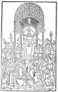

  
[Intangible Textual Heritage](../../index)  [Sacred
Sexuality](../index)  [Index](index)  [Previous](tsf07)  [Next](tsf09) 

------------------------------------------------------------------------

[Buy this Book at
Amazon.com](https://www.amazon.com/exec/obidos/ASIN/0806504560/internetsacredte)

------------------------------------------------------------------------

*The Sacred Fire*, by B.Z. Goldberg, \[1930\], at Intangible Textual
Heritage

------------------------------------------------------------------------

p. 141

# BOOK TWO

#### IN THE TEMPLE OF THE GODS

p. 142 p. 143

### CHAPTER I

### A DAY WITH BAAL

<table data-border="0">
<colgroup>
<col style="width: 100%" />
</colgroup>
<tbody>
<tr class="odd">
<td data-valign="top">
                 —<em>within his palm 
Was the mystery of life and the joy of living</em>.
</td>
</tr>
</tbody>
</table>

#### I

LET us raise our anchor in the [calendar](errata.htm#0) and recklessly
sail out into the infinity of time. It is high noon and before the chain
is pulled in we are already at the French Revolution. We witness an
ill-humored mob angered by hunger and blinded by the sudden glare of
sunlight. Passing the Place de la Concorde in Paris, we see this furious
mob beheading its king and abolishing its god. Another start and we meet
the Santa Maria with Columbus on board, ordering about his crew of
fifty-two, on the first voyage to unknown lands where people might be
free and start anew. A bit yonder, we see the smoldering flames of the
Inquisition in which people who did believe burned those who did not
believe in the faith we have just seen abolished.

As the day draws to a close, a blazing sun is setting into a sea of
darkening blue. Our path becomes gloomy and grim. Man is forced into the
strait-jackets of superstition and enveloped in fear. Here all believe
and everything is believed in. Over and above all hovers hate with its
malicious gaze and gnashing teeth. The air is thick and the compass is
straggling. We seem to have struck a whirlpool of time with no way out.
We are passing the Dark Ages.

p. 144

Sailing onward into the night we feel the hours crawl by. In the
darkness we see a huge oven with an immense fire, which was made by the
children of the East as a foundry for civilization. Into the oven have
just been thrown many a savage tribe of the West. There, in due course
of time, they are to be forged into civilized peoples. Meanwhile, the
chimney is belching forth thick smoke and dark flames, its soot covering
the face of the earth.

Still further into the night we sail until streaks of light begin to cut
the darkness. A new star rises in the east—the star of a man who
surrendered his life on the cross to gain a place in the heart of the
world. Again we move onward, passing a mountain beautiful, the divine
abode, where a god may do as a god will with a humanity looking on.
Further still, we witness a fire upon a bush that will not burn. This is
the fire everlasting, eternally illuminating the Holy of Holies of three
faiths of man.

On we advance through the night to greet approaching dawn. A diffused
light is spreading over the sky, while out of a purple horizon the
glowing sun rises to shower its golden bounty upon a hungry world. Soon
we are in the midst of daylight comforting and cheering, opening to the
children of the earth all the treasures of Mother Nature. We are in the
land of Baal, the god of the universe.

Go east or west; turn north or south; there will always be an altar to
Baal, an altar to the god most high, who holds within his palm the
mystery of life and the joy of living. On the summit of every hill and
under every green tree Baal is worshipped—the god whom people knew long
before they had heard of Jehovah, the divinity whom they loved long
after they had learned of the one and true God.

For Baal was a god, an only one and true. Other gods’

p. 145

names were never spoken, but names they had. Baal had no name. He had
neither father nor mother; nor did he spring from the sea. Unlike Jesus
he came from no definite place. Unlike Jehovah he was not interested in
one particular people. Unlike Allah he was not satisfied with one
prophet.

Baal was the one great abstract god of antiquity. He was the mighty
force in nature that mystifies us no less today than it did the men of
ancient times. He was the power that gave life and that took it away. He
was the sea of life with its tides high and low, ebbing away of nights
and rising over its boundaries in the morning. Baal was the greatest god
of all, but what was Baal? How could one fathom this infinite mystery?
Primitive man, limited in his thinking and circumscribed in his imagery,
sought a concrete form for the mightiest of the gods. So he looked into
the mirror of life and in the image of what he saw therein he created
his Baal.

The god may have hailed in the downpour of the rain or twinkled in the
dewdrop upon the unfolding leaf. Baal was in the substance that quenches
the thirst of man; in the liquid that impregnates Mother Earth and
releases the new life within her womb even as the semen of the male
impregnates the female and causes new life to sprout. Again, he was
reflected in the waters of the spring. At a spring Abraham and Lot swore
each to go his way. At a spring the patriarchs met their wives, and the
rulers of Judah were crowned kings. The ancient spring of Gihon, known
today as Bethesda, the Virgin's fountain, is still held in reverence in
Jerusalem. In Mecca, the Zemzem spring continues to well in supreme
sanctity.

Again, Baal may have risen toward the clouds with the

p. 146

towering tree, majestically spreading its leaf-hidden limbs and bearing
fruits for man and beast. The tree grew in watered places, immersed in
the liquid life-substance like the lingam in its life-bringing function.
Some trees were the mainstays of life. The date palm was one; by its
fruit it supplied many a community with its daily bread, as the father
provides the sustenance for the family. The fig tree was another. It
also furnished food for the hungry and, in addition, it offered shelter
from the blaze of the sun, like the mother caring for her young. Both in
appearance and in service the tree was the life-giving and the
life-bringing force.

Baal may also have come forward with the rising sun as it brought light
and warmth to a world lying in the cold embrace of darkness. He may have
appeared in the form of Shamash, the sun god, kissing Mother Earth with
his sunshine and penetrating her with his rays in celestial, conjugal
union.

The god may even have ascended with the rolling hilltop as the uniting
element between the universal father and mother—sky and earth, even as
the lingam among the species created by this universal pair. Olympus or
Horeb, Lebanon or Sinai may have been reincarnated as the Baal of the
mountains. There may have been a Baal in the erect stones, whether among
the twelve at Sinai, the Black Stone at Mecca, or the stelæ of Persia.
There may have been a Baal in the lion and the wolf, the bull and the
goat. There were other things and places in which the god might be
found. Wherever there was a clear suggestion of the function of Baal as
the fountain of life, wherever life was being generated or its
generators were in evidence, there was also a manifestation of Baal
incarnate.

p. 147

However different its representations, the meaning of Baal was ever the
same. However the god appeared, he always did but one thing: he brought
new life, he caused the birth of plant and animal and man. Consequently,
the worship of Baal was practically the same all over the world. He was
rewarded for his blessings of fecundity with the first products of his
function. The first fruits and the first born were sacred unto him.

But there were times when things went badly with Baal and he appeared to
have lost all his generative power. Nature seemed to die and even he
succumbed with it. All this was temporary, of course; it was the winter
season of the year, which would be succeeded by the spring, when Baal
would resurrect himself. Still, while it lasted, it was a time of
sadness and mourning. Man grieved for his god and abstained from all
pleasures. He even denied himself food and drink, and to show his
solidarity with Baal he abstained from the exercise of the function he
shared, in his own small way, with the god. He refrained from sexual
union until Baal revived.

Baal was served most appropriately, however, when he and man were in a
happier mood. It was then that the worship took the form of a feast. Man
brought to the temple of the fat of the land for the glory of the god
and his own pleasure. He freely imbibed of the wine which Baal first
taught him to use. Finally, he indulged in the act, the function of
which is the province of Baal, the act that makes for the happiness of
one generation and the advent of another. The god of fertility was
worshipped in the union of the sexes.

p. 148

#### II

All through the night the roads were crowded with pilgrims. Some were
coming in chariots, with slaves rushing ahead to herald their arrival,
and others following behind so that no commoner might approach the
conveyance. There were other pilgrims straggling along on foot, resting
now and then underneath a tree by the wayside. There were princes of the
blood and emissaries from kings. There were beggars in tatters, blind
and lame, hopping along the road like a swarm of flies, a scourge upon a
land that would forget all misery and woe.

Among the dregs of the world and the glittering stars there was the
spirit of youth marching along the trodden road to the Hill of Promise.
There was the unkissed maiden, blushing in her golden innocence, as she
was making her first visit to the temple of love. Her heart beat fast in
anticipation, like the fluttering bride first leaving her father's roof
for the greatest experience of her life.

There were the lightsome steps of the boisterous lad, who, heretofore
imprisoned in a tiny village, was having his first, full breath of
freedom as he started along the way. His joy lay beyond the pebbled road
leading up to the Sacred Hill. There was the lingering course of the
dreamy youth, absorbed in a fanciful world of his own creation, which he
conveniently located upon the sacred knoll. There was the old man,
dozing away in his oxen-drawn cart, burdened with memories of happier
visits. Another cart carried a portly matron looking wistfully eastward
toward .the Sacred Hill, the only place where her heart was ever
gladdened by forgetfulness and joy. In her hazy

p. 149

mind, she wondered what might befall her on this year's visit. Last year
she had been almost overlooked, and yet, there were years when all eyes
were upon her, when she was the first to leave the line of women waiting
to be selected by the worshippers.

All during the night the roads were crowded with pilgrims. Rich and
poor, old and young, saddened and joyous, all were going up the rising
hill to give thanks and to pray, to sacrifice or to be sacrificed on the
altar of the great master of the universe—Baal.

Nor were they coming empty-handed to the house of their god. Everyone
was bringing a gift in accordance with his means. The princes and the
emissaries of kings were trailing behind them oxen and chariots to be
turned over to the priests, in which they might, at dawn, rush eastward
to meet the rising sun, the daily reflection of Baal. The husbandman was
leading the first born of his herd and the farmer was carting along the
first products of his soil and the first fruits of his trees. Others
were carrying in the pockets of their girdles gifts of silver or of gold
and sacred trinkets and coins, all of which were offerings not
displeasing to Baal's servants in the temple.

However much each sacrifice meant to the particular individual, however
difficult it had been to provide it, he was bringing it happily in the
most generous of moods. He was offering it to the All-giver, to the very
source of gifts—to Life itself.

#### III

A cool breeze came out of the north. Strips of blue cut the paling sky.
Day was breaking. The travelers quickened their pace. Zest was added to
their steps, for

p. 150

out there in the haze and the mist was the Sacred Hill for which their
hearts had been yearning these many hours and days and weeks before.
They could hardly see it, but they were conscious of what was happening
there during the late hours of the night. On the Sacred Hill, all were
a-mourning now, mourning for Baal.

While Baal was a living god of life, his own active life was not
continuous, any more than are growth and generation upon earth. Baal
himself had his ups and downs; every year he died and was mourned by his
worshippers. Women attired themselves in mourning and went about with
streaming hair and bared breasts. The men, too, mourned in their own
way, and all were to shave their heads as an additional expression of
their grief. Those women who would not cut their hair must sacrifice
their bodies when Baal came to life again.

This was the last night of mourning, each pilgrim reminded himself.
There, in the temple, the priests must now be taking out the gilded
wooden cow from her chamber, where she had been resting for the whole
year with a golden sun between her horns. Seven times they would carry
her around the temple with torches in their hands, while outside every
house on the Sacred Hill burned lamps of oil. It was thus they besought
the goddess Ishtar to go down to the "house of darkness, where dust lies
on the bolt of the door" and to release from the arms of death the
life-god Baal.

As the anxious pilgrims hurried on, their entire thought turned toward
the temple; they fell into a familiar rhythm, the rhythm of the song of
Ishtar that they had remembered since their first visit to the Sacred
Hill. The song depicted the death of nature, while Ishtar was on her way
to revive

p. 151

the god of life; when Ishtar was away, the song went on:

"The bull did not mount the cow  
 Nor did the ass leap upon the she-ass.  
 The man did not approach the maiden.  
 The man lay down to sleep upon his couch  
 While the maid slept by herself."

\[paragraph continues\] These were the
only lines they could remember, yet the rest of the story they knew full
well. Not so easily did Ishtar succeed in bringing back the god Baal
into the world of the living. She had to go through the seven gates of
hell and, at every gate, she was required to surrender of her divinity
and of her vitality. When finally she found Baal, she was almost dead
herself. She needed the sprinkling of life-giving water to rise and to
be able to carry the god out of the depths. But as Ishtar rose to the
upper world her vitality increased. At each gate she received anew the
attributes that had been taken from her on her entrance. The goddess was
rejuvenated and exuberant when she appeared with Baal upon the soil of
man.

Now the temple lay before the anxious travelers and their hearts beat
fast at the sight of it. Within, the worshippers must now be anointing
the effigy of Baal, after they had washed it with pure water and clad it
in a red robe. As they recalled the odor of the incense always burned on
this occasion, they caught themselves mumbling the chant:

"At his vanishing away she lifts up a lament,  
 'Oh, my child'; At his vanishing away she lifts up a lament,  
 'My Damu'; At his vanishing away she lifts up a lament,  
 'My enchanter and priest'; At his vanishing away she lifts up a
lament.  
 At the shining cedar, rooted in a spacious place  
 In Eanna, above and below, she lifts up a lament. p. 152  
 Like the lament that a horse lifts up for its master  
 She lifts up a lament.  
 Like the lament a city lifts up for its lord  
 She lifts up a lament.  
 Her lament is the lament for a herb that grows not in the bed.  
 Her lament is the lament for the corn that grows not on the ear.  
 Her chamber is a possession that brings not forth a possession,  
 A weary woman, weary child forespent. . . ."

A soft breeze came out of the east, seeming to spread the light blue
strips over the heavy sky. Dawn was breaking, and, at dawn, Baal was to
come to life again. The travelers were eager in anticipation. They
wished to arrive on time. They must be on the Sacred Hill when the
rejoicing over the resurrection of Baal began.

They were already crossing the bridge, for the Sacred Hill was
surrounded by a moat filled with water, an artificial stream serving the
priests in the temple as well as the worshippers. Here they were to
bathe and to cleanse themselves, for when they entered the most sacred
chamber and faced the statue of Baal, they would have to present
themselves naked before their god. Some stripped themselves and went
seven times under the water; others were satisfied with symbolic
ablutions, merely washing their feet and hands and sprinkling their
bodies with the sacred fluid.

At the gate of the Sacred Hill, there was a priest to inspect those who
came to serve Baal, to see that there were no lepers among them and that
the sacrifices they were bringing were of the worthy kind. There were
beggars standing at the gate clamoring for alms; merchants of all kinds
were offering their wares, including votives in metal and dough—images
of Baal in the form of the generative organs. There were vendors of
wines, grapes

p. 153

[  
Click to enlarge](img/15300.jpg)  
At a Baalic festival  

and pomegranates, for all these things were equally sacred to the god.
There were, too, the money-changers and money-lenders ever preying on
those in search of pleasure.

p. 154

A marble stairway, covered with a bower of roses, led to an enclosure
paved with blue stones. There, various fruit trees were to be found:
pomegranate, almond, cypress, and myrtle. Out of this enclosure an oval
opening led into the chamber of the sacred tree, where an enormous cedar
reached toward the sky, erect, like the object it was meant to
symbolize. Another stairway led to the vestibule of Baal, where two
phallic pillars, crowned with fresh garlands, stood guarding the
entrance.

The room was very lofty with a vaulted lacework ceiling through which
one might gaze at the starry heavens to learn the fate of man. There
were pillars and serpents enshrined in niches in the walls, and in the
center of the room, before an altar, there was the image of Baal, hewn
in stone. He was sitting upon a throne, within a shrine. He had a long
beard and wore a high pointed headdress and a flowing robe, which
reached to his ankles. The roof of the shrine was supported by a column
in the form of a palm tree, standing immediately in front of the sacred
deity.

#### IV

Only a few laymen ever entered this vestibule, the holy of holies of the
great god. It was there that the high-priest worshipped, offering
incense before Baal's statue or sprinkling blood upon the corners of his
altar. Ordinarily, the prayers he offered were not for an individual but
for the people as represented by the king and for the needs of the
state. Yet it was not impossible that someone of high rank might be
personally in need of Baal, and then the high-priest intervened in his
behalf. Perhaps the wife of some man of royal blood was in difficult
labor, and who but Baal could open the "gates of her womb"?

p. 155

In such cases, the individual knelt outside the sacred chamber while the
priest offered a prayer in this fashion:

"O Baal, lofty judge, father of black-headed ones, as for this woman,
the daughter of her god, may the knot that impedes her delivery be
loosed in presence of the godhead; may the woman bring happily her
offspring to the birth; may she bear; may she remain in life, and may it
be well with the child in the womb; may she walk in health before thy
godhead. May she be happily delivered and honor thee."

Still, if the king was in need of Baal, he might enter this sacred
chamber, for he, the king, was really an offspring of the god and a
priest in his own right. In that case, he came with his offering, first
asking Baal not to mind any possible imperfections in the sacrifice:

"Heed not what the chief offering of this day may be, whether good or
bad, a stormy day on which it rains; heed not that something unclean may
have produced uncleanliness at the place of vision and rendered it
unclean. Heed not that the lamb of thy divinity, which is looked upon
for vision, be imperfect and with blemish. Heed not that he who touches
the forepart of the lamb may have put on his garment for sacrifice as
arshati; or have eaten, drunk, or rubbed himself upon something unclean.
Heed not that in the mouth of the seer, thy servant, a word may have
been passed over in haste."

Uneasy lies the head that wears a crown, and the king's visits to the
temple were as often filled with worry and anxiety as with desire for
bliss and ecstasy. When he came to seek advice or to beg favors from the
god, he was perhaps least in festive mood. His days and nights of
rejoicing were those when he returned from battle with a train of
prisoners and spoils, to share his gladness with his Baal.

p. 156

But the public little concerned itself with matters of state. The plain
people were bound to their own bits of soil, and cut loose only when in
the house of their god. They never penetrated into the holy of holies.
They never saw Baal himself, seated upon his throne of glory. They
communed with their god only through his ministry. They knew him through
the priests who received them in the outer room of the temple. There
were the altars where all their sacrifices were made. There was the odor
of fresh blood and manure, mingling with the fragrance of oils and
perfumes. There, they saw life destroyed, torn up and flowing away, down
the declining floor. There, they heard the call of blood and their own
blood answered—fiery liquid circulating in their veins.

There, too, they saw life, new life on its way toward creation. They saw
it dedicated, hallowed and suggested in the images about them and in the
dances of the priestesses within the enclosure. Life was in the song the
priestesses sang, the song of the lingam that praised the powers of
Baal. Life was in the air.

To this enclosure they all came, all who traveled the long night
through, with the love of Baal in their hearts. Here they turned in
their calves, their first fruits and the ears of corn they had gathered
from their fields. Here they gave unto the god the first taste of the
bounties that he had bestowed upon them, but they, too, shared in these
sacrifices. They feasted on what was left after the priests had taken
their portions. After the fast, the meat of the lamb was delicious
indeed, and the wine was like sweet nectar. Food and drink brought them
into that state of bliss and oblivion in which they could all the more
appreciate the lovely young priestesses dancing about like sun-

p. 157

beams on the meadow of a late afternoon—dancing the dance of youth and
love . . . Love, the god of the universe, Love, the heart of Baal.

The end of the sacrifice approaches. All are weary: Baal, his priests,
and his worshippers. Weary, perhaps not so much on account of labors
lost as because of pleasures anticipated. Everybody is waiting for the
great moment. The final sacrifice is brought. The dead lamb lies upon
the altar before the sacred cedar. Its blood has been sprinkled upon the
leaves of the tree and upon the ground that covers its roots. The sound
of the flute is heard. It is the signal for the chief priestess to
arrive. All eyes are turned toward the figure of a bull in the eastern
corner of the enclosure, to the triangular door behind it.

Again the flute is heard and a bell is rung. The door opens. The
Kadishtu appears. All hail her: "The Kadishtu, the Kadishtu, blessed be
the Kadishtu." But the Kadishtu is unmindful of all this welcome. Her
eyes are closed tightly; her face is in contortions; every muscle in her
neck and arms is taut. As if floating in the air, she slowly approaches
the opened lamb upon the altar. Her arms are extended; the fingers of
her outstretched hands quiver. She touches the sacrificial lamb. The
priest dips his finger in the blood and places it in the mouth of the
priestess. She tastes the blood and opens her dilated eyes.

Trembling, she thrusts her hand into the cadaver and tears away the
bleeding heart. As the blood gushes forth upon the altar and streams to
the floor, the Kadishtu places the heart of the lamb upon the sacred
platter. And at once the worshippers break forth in song, praising Baal,
the god of life, the god of blood.

From all sides of the room priestesses arrive, dancing

p. 158

across the enclosure and out into the open upon the Sacred Hill. They
are followed by the male worshippers with burning faces and devouring
eyes. The songs grow wilder, the contortions of the bodies more
frenzied, while the drum and the flute fill the air with passionate
tones that steal into the hungry hearts of dancer and worshipper.

The dances break up in chaotic revelry. Priestess and worshipper join in
the merry-making. Tired, drunk, half-swooning, the dancer is still
conscious of one thing: somebody will touch her navel—she must
follow—but the coin; he must first give her a coin, the coin that is
sacred to Baal.

As she is trying to seat herself, hardly able to stand upon her feet, a
worshipper touches her. She rises as if awakened from sleep. She follows
him blindly into a tent, where both priestess and worshipper consummate
the final crying prayer to Baal, the prayer of love.

   
Anubis as the guardian of the Dead

------------------------------------------------------------------------

[Next: Chapter II. A Night With Aphrodite](tsf09)
