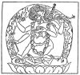
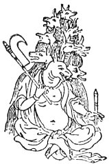

  
[Intangible Textual Heritage](../../index)  [Sacred
Sexuality](../index)  [Index](index)  [Previous](tsf11)  [Next](tsf13) 

------------------------------------------------------------------------

[Buy this Book at
Amazon.com](https://www.amazon.com/exec/obidos/ASIN/0806504560/internetsacredte)

------------------------------------------------------------------------

*The Sacred Fire*, by B.Z. Goldberg, \[1930\], at Intangible Textual
Heritage

------------------------------------------------------------------------

p. 189

### CHAPTER V

### THE DANCE OF THE SAKTAS

<table data-border="0">
<colgroup>
<col style="width: 100%" />
</colgroup>
<tbody>
<tr class="odd">
<td data-valign="top">
<em>She was the great womb of the universe, 
The goddess of womankind</em>.
</td>
</tr>
</tbody>
</table>

#### I

IF the men had their own masculine god, Moloch, and tried at least to
keep the women out of his worship, the women had their own goddesses,
doing with them whatever pleased their feminine eyes. And they did
succeed in keeping the men out for good.

Now, it is all very true that Aphrodite must be a mother, even though a
virgin. But there is absolutely no need that her offspring be male. The
cursed almond that Aphrodite carried between her breasts could just as
well produce a daughter as a son. So it was agreed by the women of
Greece that Aphrodite had a daughter, Kore, who like all divine children
had to die once a year so that she might be resurrected with the spring.
Now, when a mother mourns for her daughter it is a purely feminine
affair and no male need interfere.

Thus it was that women gathered in a most secret place and sat upon the
ground fasting, mourning, moaning, and wailing. They were helping
Aphrodite lament the loss of her daughter. Each woman brought a
sacrifice, preferably a pig, because this animal was closely associated
with all the trouble. Still, a cake of dough might do, if it was

p. 190

formed to represent the generative organs. Whatever the offering, it was
thrown into a vault or cavern something like Moloch's belly and left in
the care of the serpents for the remainder of the year.

As the year rolled by, some women were appointed "drawers." They knew
how to clap their hands so that the serpents would retire and they could
go down into the

[  
Click to enlarge](img/19000.jpg)  
The eternal Sakti  

cavern to fetch whatever remained of the pigs and the cakes of dough
that had been deposited there. Whosoever got a piece of bone or a morsel
of cake was blessed with fecundity, and, if such a piece was planted
along with the corn, an abundant crop was assured.

As the remains were brought up from the cavern, the women made merry.
They sang songs describing intimate attitudes between men and women,
while they accompanied them with suggestive dancing and exhibitions.

p. 191

#### II

The women of India, too, had a goddess whom they worshipped, just as the
men were worshipping Siva, the great god of life. The Sakti, the wife of
Siva, was for them the great goddess, the mother of the universe.
Through her, life came into the world and through her help they might
hope for great fecundity, for she was the female principle, the prime
factor in creation.

The women of India honored their goddess in feast and sacrifice. There
was the Durga-puja in the fall of the year to celebrate her victory over
the buffalo-headed demon, Mahishasura. Then the Sakti was represented in
the form of a ten-armed goddess with a weapon in each hand, and for nine
days her faithful worshippers approached her daily with gifts and
sacrifices. On the tenth day, the figure of the goddess was thrown into
the water and the feast ended.

Upon the return of spring, when all nature seems to be in love, the
goddess was in her happiest temper. It was then that she was honored as
the mother of the universe, the bringer of life. And all the young
girls, with baskets of flowers and bundles of grass, would go into the
country to observe the feast of Rali Ka mela. It was like the May feasts
so well known among us. When they reached the designated spot, they
heaped their flowers and grass together and danced and sang about the
pile.

For ten days the maidens came to the same spot to honor their goddess,
and each day they brought more flowers and more grass, and again, each
day they sang and danced about the growing pile. When it was high with
their offerings, they went into the woods where they found

p. 192

two branches each ending in three prongs. These they erected upon the
heap of flowers and placed images of Siva and his Sakti on the tops of
them. The marriage of the god and the goddess was celebrated, after
which the maidens joined together in an elaborate feast. A few days
later they carried the images to the river and cast them into the water.
Throughout the time of the festival, the

[  
Click to enlarge](img/19200.jpg)  
A female demon in ancient India  

maidens’ chief prayer was that the goddess might bless them with good
husbands.

There was another celebration, the Kali-puja, at which the goddess was
worshipped in her most dreadful form. On the darkest night of the month,
she was represented as a four-armed naked woman dancing upon the breast
of her husband. She wore a wreath made of the heads of giants she had
slain and a string of skulls encircled her neck. On this night, the
goddess was angry and must

p. 193

be appeased, so the women made sacrifices to her. Goats and sheep were
killed with one blow of the knife and the heads placed in her awful
presence, while a little earthen lamp burned above them. Then the
animals were roasted in the fire and as the women ate the flesh they
danced and sang in honor of the Sakti.

[  
Click to enlarge](img/19300.jpg)  
Devaki seated on a lotus flower and holding a lotus bud, symbols of the
two creative forces  

And so they danced in worship of their goddess, the Saktas, women rebels
in the dark of feminine servitude. However a woman was stationed in
life, no matter how submissively she lay under the heel of her husband
and master, she was a Sakta before her goddess. In the divine presence,
she would recognize no rule of the male, not even the male principle in
nature. She was a woman and the Sakti was a woman, the Sakti, the wife
of the great god

p. 194

\[paragraph continues\] Siva, yet greater
than Siva by far, the mother of all creation. The Sakti was the great
womb of the universe enveloping nature as the atmosphere envelops the
earth, and the women of India were her Saktas, human emanations of the
goddess supreme.

Let no mere male interfere then. Let the Saktas worship the goddess as a
woman will, in a world of absolute womanhood.

 

------------------------------------------------------------------------

[Next: Prologue](tsf13)
