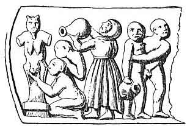

  
[Intangible Textual Heritage](../../index)  [Sacred
Sexuality](../index) 

------------------------------------------------------------------------

<table width="75%">
<colgroup>
<col style="width: 50%" />
<col style="width: 50%" />
</colgroup>
<tbody>
<tr class="odd">
<td width="50%" data-valign="CENTER"></td>
<td width="50%" data-valign="CENTER"><h1 id="the-worship-of-the-generative-powers" data-align="CENTER">THE WORSHIP OF THE GENERATIVE POWERS:</h1>
<h2 id="by-thomas-wright" data-align="CENTER">BY THOMAS WRIGHT</h2>
<h4 id="section" data-align="CENTER">[1865]</h4></td>
</tr>
</tbody>
</table>

------------------------------------------------------------------------

This work first appeared as the second half of the 1865 printing of [A
Discourse on the Worship of Priapus](../dwp/index). Wright's extended
essay on Phallic worship is distinguished by much better scholarship and
writing than some of the other works of this genre. Along with the usual
suspects (ancient and modern phallic objects, fertility rituals and so
on) Wright devotes the longest section of this text to exploring what
would become known as the 'Witch Cult'. Wright lays out a compelling
case for the survival of ancient fertility rituals in the otherwise
puzzling accounts of the Witches' Sabbath.

Production note: this text, which has no chapter divisions in the
original, has been broken down into logical sections in the production
of this etext.

------------------------------------------------------------------------

[Title Page](wgp00)  
[Antiquity](wgp01)  
[Middle Ages and Renaissance](wgp02)  
[Shelah-na-Gigs](wgp03)  
[Priapus Worship](wgp04)  
[Priapic Amulets](wgp05)  
[The 'Fig'](wgp06)  
[Sexual Demons](wgp07)  
[Phallic Festivals](wgp08)  
[May-day](wgp09)  
[Midsummer Night](wgp10)  
[Plants and Flowers](wgp11)  
[Other Festivals](wgp12)  
[Mediaeval Secret Societies](wgp13)  
[The Knights Templar](wgp14)  
[The Witches' Sabbath](wgp15)  
[Inniskea](wgp16)  
