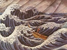

  
[Intangible Textual Heritage](../../index)  [Japan](../index) 
[Index](index)  [Previous](atfj07)  [Next](atfj09) 

------------------------------------------------------------------------

  
*Ancient Tales and Folk-lore of Japan*, by Richard Gordon Smith,
\[1918\], at Intangible Textual Heritage

------------------------------------------------------------------------

p. 44

  [  
Click to enlarge](img/07.jpg)  
7. Rosetsu Watches the Carp  

### VI

### A CARP GIVES A LESSON IN PERSEVERANCE [1](#fn_19)

BETWEEN the years 1750 and 1760 there lived in Kyoto a great painter
named Okyo-Maruyama Okyo. His paintings were such as to fetch high
prices even in those days. Okyo had not only many admirers in
consequence, but had also many pupils who strove to copy his style;
among them was one named Rosetsu, who eventually became the best of all.

When first Rosetsu went to Okyo's to study he was, without exception,
the dullest and most stupid pupil that Okyo had ever had to deal with.
His learning was so slow that pupils who had entered as students under
Okyo a year and more after Rosetsu overtook him. He was one of those
plodding but unfortunate youths who work hard, harder perhaps than most,
and seem to go backwards as if the very gods were against them.

p. 45

I have the deepest sympathy with Rosetsu. I myself became a bigger fool
day by day as I worked; the harder I worked or tried to remember the
more manifestly a fool I became.

Rosetsu, however, was in the end successful, having been greatly
encouraged by his observations of the perseverance of a carp.

Many of the pupils who had entered Okyo's school after Rosetsu had left,
having become quite good painters. Poor Rosetsu was the only one who had
made no progress whatever for three years. So disconsolate was he, and
so little encouragement did his master offer, that at last, crestfallen
and sad, he gave up the hopes he had had of becoming a great painter,
and quietly left the school one evening, intending either to go home or
to kill himself on the way. All that night he walked, and half-way into
the next, when, tired out from want of sleep and of food, he flung
himself down on the snow under the pine trees.

Some hours before dawn Rosetsu awoke, hearing a strange noise not thirty
paces from him. He could not make it out, but sat up, listening, and
glancing towards the place whence the sound—of splashing water—came.

As the day broke he saw that the noise was caused by a large carp, which
was persistently jumping out of the water, evidently trying to reach a
piece of sembei (a kind of biscuit made of rice and salt) lying on the
ice of a pond near which Rosetsu found himself. For full three hours the
fish must have been jumping thus unsuccessfully, cutting and bruising
himself against the edges of the ice until the blood flowed and many
scales had been lost.

p. 46

Rosetsu watched its persistency with admiration. The fish tried every
imaginable device. Sometimes it would make a determined attack on the
ice where the biscuit lay from underneath, by charging directly upwards;
at other times it would jump high in the air, and hope that by falling
on the ice bit by bit would be broken away, until it should be able to
reach the sembei; and indeed the carp did thus break the ice, until at
last he reached the prize, bleeding and hurt, but still rewarded for
brave perseverance.

Rosetsu, much impressed, watched the fish swim off with the food, and
reflected.

'Yes,' he said to himself: 'this has been a moral lesson to me. I will
be like this carp. I will not go home until I have gained my object. As
long as there is breath in my body I will work to carry out my
intention. I will labour harder than ever, and, no matter if I do not
progress, I will continue in my efforts until I attain my end or die.'

After this resolve Rosetsu visited the neighbouring temple, and prayed
for success; also he thanked the local deity that he had been enabled to
see, through the carp's perseverance, the line that a man should take in
life.

Rosetsu then returned to Kyoto, and to his master, Okyo, told the story
of the carp and of his determination.

Okyo was much pleased, and did his best for his backward pupil. This
time Rosetsu progressed. He became a well-known painter, the best man
Okyo ever taught, as good, in fact, as his master; and he ended by being
one of Japan's greatest painters.

Rosetsu took for crest the leaping carp.

------------------------------------------------------------------------

### Footnotes

[44:1](atfj08.htm#fr_19) One day my old painter
Busetsu was talking with me about Japan's greatest painters, and of one
of them he told a strange story. It was interesting in one thing
especially, and that was that the name of *Rosetsu* I could not find
mentioned in Louis Gonse's book, though, of course, Maruyama Okyo was.
Five names were given as those of the best pupils of Okyo; but Rosetsu
was not mentioned. I wrote to my friend the Local Governor, who is an
authority on Japanese paintings. His answer was, 'You are quite right:
Rosetsu was one of Okyo's best pupils, perhaps the best.'

------------------------------------------------------------------------

[Next: VII. Legends Told by a Fisherman on Lake Biwa, At Zeze](atfj09)

