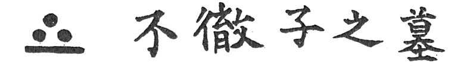

  
[Intangible Textual Heritage](../../index)  [Japan](../index) 
[Index](index)  [Previous](atfj37)  [Next](atfj39) 

------------------------------------------------------------------------

  
*Ancient Tales and Folk-lore of Japan*, by Richard Gordon Smith,
\[1918\], at Intangible Textual Heritage

------------------------------------------------------------------------

p. 223

  [  
Click to enlarge](img/41.jpg)  
41. The Sentry Finds Watanabe Tatsuzo on the Pine Branch  

### XXXVI

### A STORMY NIGHT'S TRAGEDY [1](#fn_39)

ALL who have read anything of Japanese history must have heard of Saigo
Takamori, who lived between the years 1827 and 1877. He was a great
Imperialist, fighting for the Emperor until 1876, when he gave over
owing to his disapproval of the Europeanisation going on in the country
and the abandonment of ancient national ways. As practical
Commander-in-Chief of the Imperial Army, Saigo fled to Kagoshima, where
he raised a body of faithful followers, which was the beginning of the
Satsuma Rebellion. The Imperialists defeated them, and in September of
1877 Saigo was killed—some say in the last battle, and others that he
did 'seppuku,' and that his head was cut off and secretly buried, so
that it should not fall into the hands of his enemies. Saigo Takamori
was highly honoured even by the Imperialists. It is hard to call him a
rebel. He did not rebel against his Emperor, but only against the
revolting idea of becoming Europeanised. Who can say that he was not
right? He was a man of fine sentiment and great loyalty. Should all of
us

p. 224

follow meekly the Imperial order in England if we were told that we were
to practise the manners and customs of South Sea Islanders? That would
be hardly less revolting to us than Europeanisation was to Saigo.

In the first year of Meiji i868 the Tokugawa army had been badly beaten
by Saigo at Fushimi, and Field-Marshal Tokugawa Keiki had the greatest
difficulty in getting down to the sea and escaping to Yedo. The Imperial
army proceeded along the Tokaido road, determined to break up the
Tokugawa force. Their advance guard had reached Hiratsuka, under Mount
Fuji, on the coast.

It was a spring day, the 5th of April, and the cherry trees were in full
bloom. The country folk had come in to see the victorious troops, who
formed the advance guard of those who had beaten the Tokugawa. There
were many beggars about, together with pedlars and sellers of sweets,
roasted potatoes, and what-not. Towards evening clouds carne over the
skies; at five o'clock rain began; at six every one was under cover.

At the principal inn were a party of the Headquarters’ Staff officers,
including the gallant Saigo. They were making the best of the bad
weather, and not feeling particularly lively, when they heard the soft
and melodious notes of the shakuhachi at the gate.

'That is the poor blind beggar we saw playing near the temple to-day,'
said one. 'Yes: so it is,' said another. 'The poor fellow must be very
wet and miserable. Let us call him in.'

'A capital idea,' assented all of them, among whom was Saigo Takamori.
'We will have him in and raise a

p. 225

subscription for him if he can raise our spirits in this weather.' They
gave the landlord an order to admit the blind flute-player.

The poor man was led in by a side door and brought into the presence of
the officers. 'Gentlemen,' said he, you have done me a very great
honour, and a kindness, for it is not pleasant to stand outside playing
in the rain with cotton clothes on. I think I can repay you, for I am
said to play the shakuhachi well. Since I have been blind it has become
my only pleasure, and not only that but also my only means of living. It
is hard now in these unsettled days, when everything is upside-down, to
earn a living. Not many travellers come to the inns while the Imperial
troops occupy them. These are hard days, gentlemen.'

'They may be hard days for you, poor blind fellow; but say nothing
against the Imperial troops, for we have to be suspicious, there being
spies of the Tokugawa. Three eyes, indeed, does each of us need in his
head.'

'Well, well, I have no wish to say aught against the Imperial troops,'
said the blind man. 'All I have to say is that it is precious hard for a
blind man to earn enough rice wherewith to fill his stomach. Only once
a-week on an average am I called to play to private parties or to
shampoo some rheumatic person such as this wet weather produces—the
blessing of the Gods be on it!'

'Well, we will see what we can do for you, poor fellow,' said Saigo. 'Go
round the room, and see what you can collect, and then we will start the
concert.'

Matsuichi did as he was bid, and returned to Saigo

p. 226

some ten minutes later with five or six yen, to which Saigo added,
saying:

'There, poor fellow: what do you think of that? Say no more that the
Imperial troops cause you to have an empty belly. Say, rather, that if
you lived near them long the skin of your belly might become so
overstretched as to cause you perforce to open your eyes, and then
indeed you might find yourself put about for a trade. But let us hear
your music. We are dull of spirit to-night, and want enlivening.'

'Oh, gentlemen, this is too much, far too much, for my poor music! Take
some of it back.'

'No, no,' they answered. 'We are troops and officers of the Imperial
Army: our lives are uncertain from day to day. It is a pleasure to give,
and to enjoy music when we can.'

The blind man began to play, and he played long and late. Sometimes his
airs were lively, and at other times as mournful as the spring wind
which blew through the cherry trees; but his manner was enchanting, and
all were grateful to him for having afforded a night's amusement. At
eleven o'clock the concert finished and they went to rest; the blind
beggar left the inn; and Kato Shichibei, the proprietor, locked it up,
in spite of the sentries posted outside.

The inn was surrounded by hedges, and several clumps of bamboos stood in
the corners. At the far end was an artificial mountain with a lake at
its foot, and near the lake a little summer-house over which towered a
huge and ancient pine tree, one of the branches of which stretched right
back over the roof of the inn. At about one o'clock

p. 227

in the morning the form of a man might have been seen stealthily
climbing this huge tree until he had reached the branch which hung over
the inn. There he stretched himself flat, and began squirming along,
evidently intent upon reaching the upper floor of the house.
Unfortunately for himself, he cracked a small branch of dead wood, and
the sound caused a sentry to look up. 'Who goes there?' cried he,
bringing his musket round; but there was no answer. The sentry shouted
for help, and it was not more than twenty seconds before the whole house
was up and out. No escape for the man on the tree was possible. He was
taken prisoner. Imagine the astonishment of all when they found that he
was the blind beggar, but now not blind at all; his eyes flashed fire of
indignation at his captors, for the great plan of his young life was
dead.

'Who is he?' cried one and all, 'and why the trickery of being blind
last evening?'

'A spy—that is what he is! A Tokugawa spy,' said one. 'Take him to
Headquarters, so that the chief officers may interrogate him; and be
careful to hold his hands, for he has every appearance of being a
samurai and a fighter.'

And so the prisoner was led off to the Temple of Hommonji, where the
Headquarters of the Staff temporarily were.

The prisoner was brought into the presence of Saigo Takamori and four
other Imperial officers, one of whom was Katsura Kogoro. He was made to
kneel. Then Saigo, who was the Chief, said, 'Hold your head up and give
us your name.'

p. 228

The prisoner answered:

'I am Watanabe Tatsuzo. I am one of those who have the honour of
belonging to the bodyguard of the Tokugawa Government.'

'You are bold,' said Saigo. 'Will you have the goodness to tell us why
you have been masquerading as a blind beggar, and why you were caught in
an attempt to break into the inn?'

'I found that the Imperial Ambassador was sleeping there, and our cause
is not bettered by killing ordinary officers!'

'You are a fool,' answered Saigo. 'How much better would you find
yourself off if you killed Yanagiwara, Hashimoto, or Katsura?'

'Your question is stupid,' was the unabashed answer. 'Every man of us
does his little. My efforts are only a fragment; but little by little we
shall gain our ends.'

'Have you a comrade here?' asked Saigo.

'Oh, no,' answered the prisoner. 'We act individually as we think best
for the cause. It was my intention to kill any one of importance whose
death might strengthen us. I was acting entirely as I thought best.'

And Saigo said:

'Your loyalty does you credit, and I admire you for that; but you should
recognise that after the last victory of the Imperial troops at Fushimi
the Tokugawa's tenure of office, extending over three hundred years, has
come to an end. It is only natural that the Imperial family should
return to power. Your intention is presumably to support a power that is
finished. Have you never heard the proverb which says that "No single
support

p. 229

can hold a falling tower"? Now tell me truthfully the absurd ideas which
appear to exist in your mind. Do you really think that the Tokugawa have
any further chance?'

'If you were any other than the heroic or admirable Saigo I should
refuse to answer these questions,' said the prisoner; 'but, as you are
the great Saigo Takamori and I admire your loyalty and courage, I will
confess that after our defeat some two hundred of us samurai formed into
a society swearing to sacrifice our lives to the cause in any way that
we were able. I regret to say that nearly all ran away, and that I am
(as far as I am able to judge) about the only one left. As you will
execute me, there will be none.'

'Stop,' cried Saigo: 'say no more. Let me ask you: Will you not join us?
Look upon the Tokugawa as dead. Too many faithful but ignorant samurai
have died for them. The Imperial family must reign: nine-tenths of the
country demand it. Though your guilt stands confessed, your loyalty is
admirable, and we should gladly take you to our side. Think before you
answer.'

No thought was necessary. Watanabe Tatsuzo answered instantly.

'No—never. Though alone, I will not be unfaithful to my cause. You had
better behead me before the day dawns. I see the strength of your
arguments that the Imperial family must and should reign; but that
cannot alter my decision with regard to my own fate;

Saigo stood up and said:

'Here is a man whom we must respect. There are many Tokugawa who have
joined our cause through fear;

p. 230

but they retain hate in their hearts. Look, all of you, at this
Watanabe, and forget him not, for he is a noble man and true to the
death.' So saying, Saigo bowed to Watanabe, and then, turning to the
guard, said:

'Take the prisoner to the Sambon matsu, [1](#fn_40) and behead him as soon as the day dawns.'

Watanabe Tatsuzo was led forth and executed accordingly.

There is a cross-road on the way leading to Mariko, to the right of the
Nitta Ferry, some five or six cho from the hill where is the Hommonji
Temple, Ikegami, in Ebaragun, Tokio fu, where there is a little grave
with a tombstone over it and the characters:

 

written thereon. They mean *Tomb of Futetsu-shi*, and it is here that
Watanabe Tatsuzo is said to have been buried.

------------------------------------------------------------------------

### Footnotes

[223:1](atfj38.htm#fr_39) Fukuga told me this
story and vouches for its accuracy.

[230:1](atfj38.htm#fr_40) Three Pines.

------------------------------------------------------------------------

[Next: XXXVII. The Kakemono Ghost of Aki Province](atfj39)

