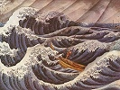

  
[Intangible Textual Heritage](../../index)  [Japan](../index) 
[Index](index)  [Previous](atfj51)  [Next](atfj53) 

------------------------------------------------------------------------

  
*Ancient Tales and Folk-lore of Japan*, by Richard Gordon Smith,
\[1918\], at Intangible Textual Heritage

------------------------------------------------------------------------

p. 312

  [  
Click to enlarge](img/56.jpg)  
56. Rokugo Sees a Ghostly Spirit  

### L

### THE SNOW TOMB [1](#fn_49)

MANY years ago there lived a young man of the samurai class who was much
famed for his skill in fencing in what was called the style of Yagyu. So
adept was he, he earned by teaching, under his master, no less than
thirty barrels of rice and two 'rations'—which, I am told, vary from one
to five sho—a month. As one sho is .666 feet square, our young samurai,
Rokugo Yakeiji, was well off.

The seat of his success was at Minami-wari-gesui, Hongo Yedo. His
teacher was Sudo Jirozaemon, and the school was at Ishiwaraku.

Rokugo was in no way proud of his skill. It was the modesty of the
youth, coupled with cleverness, that had prompted the teacher to make
his pupil an assistant-master. The school was one of the best in Tokio,
and there were over 10o pupils.

One January the pupils were assembled to celebrate the New Year, and on
this the seventh day of it were

p. 313

drinking nanakusa—a kind of sloppy rice in which seven grasses and green
vegetables are mixed, said to keep off all diseases for the year. The
pupils were engaged in ghost stories, each trying to tell a more
alarming one than his neighbour, until the hair of many was practically
on end, and it was late in the evening. It was the custom to keep the
7th of January in this way, and they took their turns by drawing
numbers. One hundred candles were placed in a shed at the end of the
garden, and each teller of a story took his turn at bringing one away,
until they had all told a story; this was to upset, if possible, the
bragging of the pupil who said he did not believe in ghosts and feared
nothing.

At last it came to the turn of Rokugo. After fetching his candle from
the end of the garden, he spoke as follows:

'My friends, listen to my story. It is not very dreadful; but it is
true. Some three years ago, when I was seventeen, my father sent me to
Gifu, in Mino Province. I reached on the way a place called Nakimura
about ten o'clock in the evening. Outside the village, on some wild
uncultivated land, I saw a curious fireball. It moved here and there
without noise, came quite close to me and then went away again, moving
generally as if looking for something; it went round and round over the
same ground time after time. It was generally five feet off the ground;
but sometimes it went lower. I will not say that I was frightened,
because subsequently I went to the Miyoshiya inn, and to bed, without
mentioning what I had seen to any one; but I can assure you all that I
was very glad to be in the house. Next morning

p. 314

my curiosity got the better of me. I told the landlord what I had seen,
and he recounted to me a story. He said: "About 200 years ago a great
battle was fought here, and the general who was defeated was himself
killed. When his body was recovered, early in the action, it was found
to be headless. The soldiers thought that the head must have been stolen
by the enemy. One, more anxious than the rest to find his master's head,
continued to search while the action went on. While searching he himself
was killed. Since that evening, 200 years ago, the fireball has been
burning after ten o'clock. The people from that time till now have
called it *Kubi sagashi no hi*." [1](#fn_50) As
the master of the inn finished relating this story, my friends, I felt
an unpleasant sensation in the heart. It was the first thing of a
ghostly kind that I had seen.'

The pupils agreed that the story was strange. Rokugo pushed his toes
into his 'geta' (clogs), and started to fetch his candle from the end of
the garden. He had not proceeded far into the garden before he heard the
voice of a woman. It was not very dark, as there was snow on the ground;
but Rokugo could see no woman. He had got as far as the candles when he
heard the voice again, and, turning suddenly, saw a beautiful woman of
some eighteen summers. Her clothes were fine. The obi (belt) was tied in
the tateyanojiri (shape of the arrow standing erect, as an arrow in a
quiver). The dress was all of the pine-and-bamboo pattern, and her hair
was done in the shimada style. Rokugo stood looking at her with wonder
and admiration. A minute's reflection

p. 315

showed him that it could be no girl, and that her beauty had almost made
him forget that he was a samurai.

'No: it is no real woman: it is a ghost. What an opportunity for me to
distinguish myself before all my friends!'

Saying which, he drew his sword, tempered by the famous Moriye Shinkai,
and with one downward cut severed head, body, and all, into halves.

He ran, seized a candle, and took it back to the room where the pupils
were awaiting him; there he told the story, and begged them to come and
see the ghost. All the young men looked at one another, none of them
being partial to ghosts in what you may call real life. None cared to
venture; but by and by Yamamoto Jonosuke, with better courage than the
rest, said, 'I will go,' and dashed off. As soon as the other pupils saw
this, they also, gathering pluck, went forth into the garden.

When they came to the spot where the dead ghost was supposed to lie,
they found only the remains of a snow man which they themselves had made
during the day; and this was cut in half from head to foot, just as
Rokugo had described. They all laughed. Several of the young samurai
were angry, for they thought that Rokugo had been making fools of them;
but when they returned to the house they soon saw that Rokugo had not
been trifling. They found him sitting with an air of great haughtiness,
and thinking that his pupils would now indeed see how able a swordsman
he was.

However, they looked at Rokugo scornfully, and addressed him thus:

p. 316

'Indeed, we have received remarkable evidence of your ability. Even the
small boy who throws a stone at a dog would have had the courage to do
what you did!'

Rokugo became angry, and called them insolent. He lost his temper to
such an extent that for a moment his hand flew to his sword hilt, and he
even threatened to kill one or two of them.

The samurai apologised for their rudeness, but added: 'Your ghost was
only the snow man we made ourselves this morning. That is why we tell
you that a child need not fear to attack it.'

At this information Rokugo was confounded, and he in his turn apologised
for his temper; nevertheless, he said he could not understand how it was
possible for him to mistake a snow man for a female ghost. Puzzled and
ashamed, he begged his friends not to say any more about the matter, but
keep it to themselves; thereupon he bade them farewell and left the
house.

It was no longer snowing; but the snow lay thick upon the ground. Rokugo
had had a good deal of saké, and his gait was not over-steady as he made
his way home to Warigesui.

When he passed near the gates of the Korinji Temple he noticed a woman
coming faster than he could understand through the temple grounds. He
leaned against the fence to watch her. Her hair was dishevelled, and she
was all out of order. Soon a man came running behind her with a
butcher's knife in his hand, and shouted as he caught her:

'You wicked woman! You have been unfaithful to

p. 317

your poor husband, and I will kill you for it, for I am his friend.'

Stabbing her five or six times, he did so, and then moved away. Rukugo,
resuming his way homewards, thought what a good friend must be the man
who had killed the unfaithful wife. A bad woman justly rewarded with
death, thought he.

Rokugo had not gone very far, however, when, to his utter astonishment,
he met face to face the woman whom he had just seen killed. She was
looking at him with angry eyes, and she said:

'How can a brave samurai watch so cruel a murder as you have just seen,
enjoying the sight?'

Rokugo was much astonished.

'Do not talk to me as if I were your husband,' said he, 'for I am not. I
was pleased to see you killed for being unfaithful. Indeed, if you are
the ghost of the woman I shall kill you myself! 'Before he could draw
his sword the ghost had vanished.

Rokugo continued his way, and on nearing his house he met a woman, who
came up to him with horrible face and clenched teeth, as if in agony.

He had had enough troubles with women that evening. They must be foxes
who had assumed the forms of women, thought he, as he continued to gaze
at this last one.

At that moment he recollected that he had heard of a fact about
fox-women. It was that fire coming from the bodies of foxes and badgers
is always so bright that even on the darkest night you can tell the
colour of their hair, or even the figures woven in the stuffs they wear,
when

p. 318

assuming the forms of men or women; it is clearly visible at one ken
(six feet). Remembering this, Rokugo approached a little closer to the
woman; and, sure enough, he could see the pattern of her dress, shown up
as if fire were underneath. The hair, too, seemed to have fire under it.

Knowing now that it was a fox he had to do with, Rokugo drew his best
sword, the famous one made by Moriye, and proceeded to attack carefully,
for he knew he should have to hit the fox and not the spirit of the fox
in the woman's form. (It is said that whenever a fox or a badger
transforms itself into human shape the real presence stands beside the
apparition. If the apparition appears on the left side, the presence of
the animal himself is on the right.)

Rokugo made his attack accordingly, killing the fox and consequently the
apparition.

He ran to his house, and called up his relations, who came flocking out
with lanterns. Near a myrtle tree which was almost two hundred years
old, they found the body—not of fox or badger, but—of an otter. The
animal was carried home. Next day invitations were issued to all the
pupils at the fencing-school to come and see it, and a great feast was
given. Rokugo had wiped away a great disgrace. The pupils erected a tomb
for the beast; it is known as 'Yukidzuka' (The Snow Tomb), and is still
to be seen in the Korinji Temple at Warigesui Honjo, in Tokio.

------------------------------------------------------------------------

### Footnotes

[312:1](atfj52.htm#fr_49) Told to me by Fukuchi,
in connection with the fire-lights in foxes. Carefully translated by Mr.
Watanabe, of the Prefectural Government.

[314:1](atfj52.htm#fr_50) The head-seeking fire.

------------------------------------------------------------------------

[Next: LI. The Dragon-Shaped Plum Tree](atfj53)

