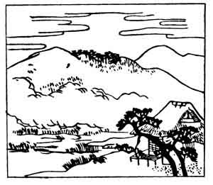

  
[Intangible Textual Heritage](../../index)  [Japan](../index.md) 
[Index](index)  [Previous](hvj002)  [Next](hvj004.md) 

------------------------------------------------------------------------

[Buy this Book on
Kindle](https://www.amazon.com/exec/obidos/ASIN/B002HRE8VG/internetsacredte.md)

------------------------------------------------------------------------

  
*A Hundred Verses from Old Japan (The Hyakunin-isshu)*, tr. by William
N. Porter, \[1909\], at Intangible Textual Heritage

------------------------------------------------------------------------

p. 2

 

### 2

### THE EMPRESS JITŌ

### JITŌ TENNŌ

  Haru sugite  
Natsu ki ni kerashi  
  Shirotae no  
Koromo hosu teu  
Ama-no-kagu yama

THE spring has gone, the summer's come,  
  And I can just descry  
The peak of Ama-no-kagu,  
  Where angels of the sky  
  Spread their white robes to dry.

The Empress Jitō reigned A.D. 690-696, during which
time saké was first made and drunk in Japan; she was the daughter of the
Emperor Tenchi, the writer of the previous verse, and she married the
Emperor Temmu, ascending the throne herself on his death. The poem
refers to a snow-capped mountain just visible on the horizon. One of the
Nō dramas relates, that an angel once came to a pine forest on the coast
near Okitsu, and, hanging her feather mantle on a pine tree, climbed a
neighbouring mountain to view Mount Fuji; a fisherman, however, found
the robe and was about to carry it off with him, when the angel
reappeared and begged him to give it her, as without it she could not
return to the moon where she lived. He only consented to do so, however,
on condition that she would dance for him; and this she accordingly did,
draped in her feathery robe on the sandy beach under the shade of the
pine trees; after which she floated heavenward, and was lost to
view.

------------------------------------------------------------------------

[Next: 3. The Nobleman Kaki-no-Moto: Kaki-no-Moto no Hitomaro](hvj004.md)
