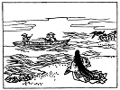
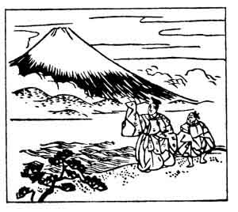

  
[Intangible Textual Heritage](../../index)  [Japan](../index) 
[Index](index)  [Previous](hvj004)  [Next](hvj006) 

------------------------------------------------------------------------

[Buy this Book on
Kindle](https://www.amazon.com/exec/obidos/ASIN/B002HRE8VG/internetsacredte)

------------------------------------------------------------------------

  
*A Hundred Verses from Old Japan (The Hyakunin-isshu)*, tr. by William
N. Porter, \[1909\], at Intangible Textual Heritage

------------------------------------------------------------------------

p. 4

 

### 4

### AKAHITO YAMABE

### YAMABE NO AKAHITO

  Tago no ura ni  
Uchi-idete mireba  
  Shirotae no  
Fuji no takane ni  
Yuki wa furi-tsutsu.

I STARTED off along the shore,  
  The sea shore at Tago,  
And saw the white and glist’ning peak  
  Of Fuji all aglow  
  Through falling flakes of snow.

Akahito Yamabe lived about A.D. 700, and was one of
the greatest of the early poets; he was contemporary with Kaki-no-Moto,
the writer of the previous verse, and like him was deified as a God of
Poetry. Tago is a seaside place in the Province of Izu, famous for its
beautiful view of Mount Fuji.

------------------------------------------------------------------------

[Next: 5. Saru Maru, A Shinto Official: Saru Maru Taiu](hvj006)
