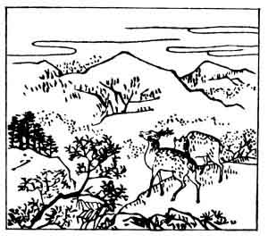

  
[Intangible Textual Heritage](../../index)  [Japan](../index.md) 
[Index](index)  [Previous](hvj005)  [Next](hvj007.md) 

------------------------------------------------------------------------

[Buy this Book on
Kindle](https://www.amazon.com/exec/obidos/ASIN/B002HRE8VG/internetsacredte.md)

------------------------------------------------------------------------

  
*A Hundred Verses from Old Japan (The Hyakunin-isshu)*, tr. by William
N. Porter, \[1909\], at Intangible Textual Heritage

------------------------------------------------------------------------

p. 5

 

### 5

### SARU MARU, A SHINTO OFFICIAL

### SARU MARU TAIU

  Oku yama ni  
Momiji fumi wake  
  Naku shika no  
Koe kiku toki zo  
Aki wa kanashiki.

HEAR the stag's pathetic call  
  Far up the mountain side,  
While tramping o'er the maple leaves  
  Wind-scattered far and wide  
  This sad, sad autumn tide.

Very little is known of this writer, but he probably
lived not later than A.D. 800. Stags and the crimson leaves of the maple
are frequently used symbolically of autumn.

------------------------------------------------------------------------

[Next: 6. The Imperial Adviser Yakamochi: Chū-nagon Yakamochi](hvj007.md)
