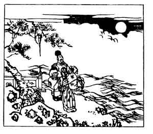

  
[Intangible Textual Heritage](../../index)  [Japan](../index.md) 
[Index](index)  [Previous](hvj007)  [Next](hvj009.md) 

------------------------------------------------------------------------

[Buy this Book on
Kindle](https://www.amazon.com/exec/obidos/ASIN/B002HRE8VG/internetsacredte.md)

------------------------------------------------------------------------

  
*A Hundred Verses from Old Japan (The Hyakunin-isshu)*, tr. by William
N. Porter, \[1909\], at Intangible Textual Heritage

------------------------------------------------------------------------

p. 7

 

### 7

### NAKAMARO ABE

### ABE NO NAKAMARO

  Ama no hara  
Furisake-mireba  
  Kasuga naru  
Mikasa no yama ni  
Ideshi tsuki kamo.

WHILE gazing up into the sky,  
  My thoughts have wandered far;  
Methinks I see the rising moon  
  Above Mount Mikasa  
  At far-off Kasuga.

The poet, when sixteen years of age, was sent with
two others to China, to discover the secret of the Chinese calendar, and
on the night before sailing for home his friends gave him a farewell
banquet. It was a beautiful moonlight night, and after dinner he
composed this verse. Another account, however, says that the Emperor of
China, becoming suspicious, caused him to be invited to a dinner at the
top of a high pagoda, and then had the stairs removed, in order that he
might be left to die of hunger. Nakamaro is said to have bitten his hand
and written this verse with his blood, after which he appears to have
escaped and fled to Annam. Kasuga, pronounced Kasunga, is a famous
temple at the foot of Mount Mikasa, near Nara, the poet's home; the
verse was written in the year 726, and the author died in 780.

------------------------------------------------------------------------

[Next: 8. The Priest Kizen: Kizen Hōshi](hvj009.md)
