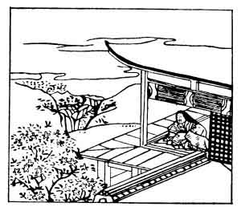

  
[Intangible Textual Heritage](../../index)  [Japan](../index.md) 
[Index](index)  [Previous](hvj009)  [Next](hvj011.md) 

------------------------------------------------------------------------

[Buy this Book on
Kindle](https://www.amazon.com/exec/obidos/ASIN/B002HRE8VG/internetsacredte.md)

------------------------------------------------------------------------

  
*A Hundred Verses from Old Japan (The Hyakunin-isshu)*, tr. by William
N. Porter, \[1909\], at Intangible Textual Heritage

------------------------------------------------------------------------

p. 9

 

### 9

### KOMACHI ONO

### ONO NO KOMACHI

  Hana no iro wa  
Utsuri ni keri na  
  Itazura ni  
Waga mi yo ni furu  
Nagame seshi ma ni.

THE blossom's tint is washed away  
  By heavy showers of rain;  
My charms, which once I prized so much,  
  Are also on the wane,  
  Both bloomed, alas! in vain.

The writer was a famous poetess, who lived A.D. 834-880. She is
remembered for her talent, her beauty, her pride, her love of luxury,
her frailty, and her miserable old age. The magic of her art is said to
have overcome a severe drought, from which the country suffered in the
year 866, when prayers to the Gods had proved useless.

The first and last couplets may mean either 'the blossom's tint fades
away under the continued downpour of rain in the world', or 'the beauty
of this flower (i.e. herself) is fading away as I grow older and older
in this life'; while the third line dividing the two couplets means,
that the flower's tint and her own beauty are alike only vanity. This
verse, with its double meaning running throughout, is an excellent
example of the characteristic Japanese play upon words.

------------------------------------------------------------------------

[Next: 10. Semi Maru](hvj011.md)
