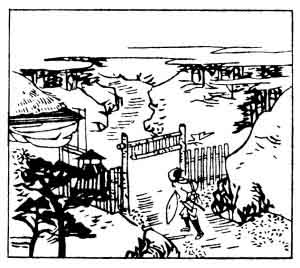

  
[Intangible Textual Heritage](../../index)  [Japan](../index) 
[Index](index)  [Previous](hvj010)  [Next](hvj012) 

------------------------------------------------------------------------

[Buy this Book on
Kindle](https://www.amazon.com/exec/obidos/ASIN/B002HRE8VG/internetsacredte)

------------------------------------------------------------------------

  
*A Hundred Verses from Old Japan (The Hyakunin-isshu)*, tr. by William
N. Porter, \[1909\], at Intangible Textual Heritage

------------------------------------------------------------------------

p. 10

 

### 10

### SEMI MARU

  Kore ya kono  
Yuku mo kaeru mo  
  Wakarete wa  
Shiru mo shiranu mo  
Ausaka no seki.

THE stranger who has travelled far,  
  The friend with welcome smile,  
All sorts of men who come and go  
  Meet at this mountain stile,—  
  They meet and rest awhile.

Semi Marti is said to have been the son of the
Emperor Uda, who reigned A.D. 888-897. He became blind, and so, being
unable to ascend the throne, he retired to a hut on the hills, near to a
barrier gate, and amused himself with his guitar. The translation does
not fully reproduce the antithesis of the original—'this or that man,
people coming and going, long lost friends and strangers'. The last line
is literally 'the barrier on the mountain road of meeting'; and Ōsaka no
Seki, as the name is now spelled, a small hill on the edge of Lake Biwa,
not far from Kyōto, is the site commemorated in this verse.

------------------------------------------------------------------------

[Next: II. The Privy Councillor Takamura: Sangi Takamura](hvj012)
