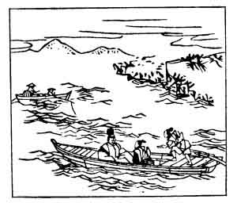

  
[Intangible Textual Heritage](../../index)  [Japan](../index) 
[Index](index)  [Previous](hvj011)  [Next](hvj013) 

------------------------------------------------------------------------

[Buy this Book on
Kindle](https://www.amazon.com/exec/obidos/ASIN/B002HRE8VG/internetsacredte)

------------------------------------------------------------------------

  
*A Hundred Verses from Old Japan (The Hyakunin-isshu)*, tr. by William
N. Porter, \[1909\], at Intangible Textual Heritage

------------------------------------------------------------------------

p. 11

 

### 11

### THE PRIVY COUNCILLOR TAKAMURA

### SANGI TAKAMURA

  Wada no hara  
Yasoshima kakete  
  Kogi idenu to  
Hito ni wa tsugeyo  
Ama no tsuribune.

OH! Fishers in your little boats,  
  Quick! tell my men, I pray,  
They'll find me at Yasoshima,  
  I'm being rowed away  
  Far off across the bay.

Takamura, a well-known scholar, rose from poverty to
riches on being appointed a Custom-house officer for the ships trading
to and from China. His enemies reported him to the Emperor as an
extortioner and a thief, and he was deported to Yasoshima, a group of
small islands off the coast; he is said to have composed this song and
sung it to the fishing-boats, as he was being carried off. He was
afterwards pardoned and reinstated, dying in the year 852.

------------------------------------------------------------------------

[Next: 12. Bishop Henjō: Sōjō Henjō](hvj013)
