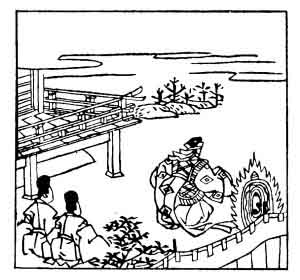

  
[Intangible Textual Heritage](../../index)  [Japan](../index) 
[Index](index)  [Previous](hvj012)  [Next](hvj014) 

------------------------------------------------------------------------

[Buy this Book on
Kindle](https://www.amazon.com/exec/obidos/ASIN/B002HRE8VG/internetsacredte)

------------------------------------------------------------------------

  
*A Hundred Verses from Old Japan (The Hyakunin-isshu)*, tr. by William
N. Porter, \[1909\], at Intangible Textual Heritage

------------------------------------------------------------------------

p. 12

 

### 12

### BISHOP HENJŌ

### SŌJŌ HENJŌ

  Amatsu kaze  
Kumo no kayoiji  
  Fuki tojiyo  
Otome no sugata  
Shibashi todomemu.

OH stormy winds, bring up the clouds,  
  And paint the heavens grey;  
Lest these fair maids of form divine  
  Should angel wings display,  
  And fly far far away.

The poet's real name was Munesada Yoshimune, and he
was the great-grandson of the Emperor Kwammu. On the death of the
Emperor Nimmyō, to whom he was much devoted (A.D. 850), he took holy
orders, and in the year 866 was made a bishop. He died in the year 890,
at the age of seventy, from being buried, by his own wish, in a small
stone tomb covered with soil, with only a small pipe leading from his
mouth to the open air; he remained thus, until hunger and exhaustion put
an end to his life. He is said to have composed the above verse, before
he entered the priesthood, on seeing a dance of some maidens at a Court
entertainment; he pretends that the ladies are so beautiful that they
can be nothing less than angels, and he is afraid they will fly away,
unless the wind will bring up the clouds to bar their passage. In the
picture he is shown with two acolytes, apparently addressing the
wind.

------------------------------------------------------------------------

[Next: 13. The Retired Emperor Yōzei: Yōzei In](hvj014)
