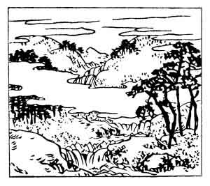

  
[Intangible Textual Heritage](../../index)  [Japan](../index) 
[Index](index)  [Previous](hvj013)  [Next](hvj015) 

------------------------------------------------------------------------

[Buy this Book on
Kindle](https://www.amazon.com/exec/obidos/ASIN/B002HRE8VG/internetsacredte)

------------------------------------------------------------------------

  
*A Hundred Verses from Old Japan (The Hyakunin-isshu)*, tr. by William
N. Porter, \[1909\], at Intangible Textual Heritage

------------------------------------------------------------------------

p. 13

 

### 13

### THE RETIRED EMPEROR YŌZEI

### YŌZEI IN

  Tsukuba ne no  
Mine yori otsuru  
  Mina no kawa  
Koi zo tsumorite  
Fuchi to nari nuru.

THE Mina stream comes tumbling down  
  From Mount Tsukuba's height;  
Strong as my love, it leaps into  
  A pool as black as night  
  With overwhelming might.

It was a frequent custom in the old days for the Emperors of Japan to
retire into the church or private life, when circumstances demanded it.
The Emperor Yōzei, who was only nine years of age when he came to the
throne, went out of his mind, and was forced by Mototsune Fujiwara to
retire; he reigned A.D. 877-884, and did not die till the year 949. The
verse was addressed to the Princess Tsuridono-no-Miko. Mount Tsukuba
(2,925 feet high) and the River Mina are in the Province of Hitachi.

*Koi* here means the dark colour of the water from its depth, but it
also means his love, and is to be understood both ways. Note also
*mine*, a mountain peak, and *Mina*, the name of the river.

------------------------------------------------------------------------

[Next: 14. The Minister-of-the-Left of the Kawara (District of Kyōto):
Kawara no Sadaijin](hvj015)
