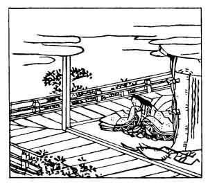

  
[Intangible Textual Heritage](../../index)  [Japan](../index) 
[Index](index)  [Previous](hvj014)  [Next](hvj016) 

------------------------------------------------------------------------

[Buy this Book on
Kindle](https://www.amazon.com/exec/obidos/ASIN/B002HRE8VG/internetsacredte)

------------------------------------------------------------------------

  
*A Hundred Verses from Old Japan (The Hyakunin-isshu)*, tr. by William
N. Porter, \[1909\], at Intangible Textual Heritage

------------------------------------------------------------------------

p. 14

 

### 14

### THE MINISTER-OF-THE-LEFT OF THE KAWARA (DISTRICT OF KYŌTO)

### KAWARA NO SADAIJIN

  Michinoku no  
Shinobu moji-zuri  
  Tare yue ni  
Midare-some nishi  
Ware naranaku ni.

AH! why does love distract my thoughts,  
  Disordering my will!  
I'm like the pattern on the cloth  
  Of Michinoku hill,—  
  All in confusion still.

The old capital of Kyōto was divided into right and
left districts, and the above is only an official title; the poet's name
was Tōru Minamoto, and he died in the year 949. At Michinoku, in the
Province of Iwashiro, in old times a kind of figured silk fabric was
made, called *moji-zuri*, embroidered with an intricate pattern, which
was formed by placing vine leaves on the material, and rubbing or
beating them with a stone until the impression was left on the silk.
There is a hill close by, called Mount Shinobu, and a small temple,
called Shinobu Moji-zuri Kwannon. *Shinobu* can also mean 'a vine', 'to
love', or to 'conceal (my love)'. The meaning of this very involved
verse appears to be, that his thoughts are as confused with love as the
vine pattern on the embroidered fabric made at Mount Michinoku. The
picture seems to show the lady with whom the poet was in love.

------------------------------------------------------------------------

[Next: 15. The Emperor Kwōkō: Kwōkō Tennō](hvj016)
