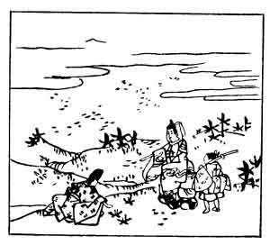

  
[Intangible Textual Heritage](../../index)  [Japan](../index) 
[Index](index)  [Previous](hvj015)  [Next](hvj017) 

------------------------------------------------------------------------

[Buy this Book on
Kindle](https://www.amazon.com/exec/obidos/ASIN/B002HRE8VG/internetsacredte)

------------------------------------------------------------------------

  
*A Hundred Verses from Old Japan (The Hyakunin-isshu)*, tr. by William
N. Porter, \[1909\], at Intangible Textual Heritage

------------------------------------------------------------------------

p. 15

 

### 15

### THE EMPEROR KWŌKŌ

### KWŌKŌ TENNŌ

  Kimi ga tame  
Haru no no ni idete  
  Wakana tsumu  
Waga koromode ni  
Yuki wa furi-tsutsu.

MOTHER, for thy sake I have been  
  Where the wakana grow,  
To bring thee back some fresh green leaves  
  And see—my koromo  
  Is sprinkled with the snow!

Kwōkō was raised to the throne by the Fujiwara family, when the mad
Emperor Yōzei was deposed; he reigned A.D. 885-887, and is said to have
composed this verse in honour of his grandmother.

*Wakana*, literally 'young leaves', is a vegetable in season at the New
Year; a *koromo* is really a priest's garment, but is used here for the
Emperor's robe.

In the picture we see the Emperor gathering the fresh green leaves, and
the snow falling from the sky.

------------------------------------------------------------------------

[Next: 16. The Imperial Adviser Yuki-hira Ariwara: Chū-Nagon Ariwara no
Yuki-hira](hvj017)
