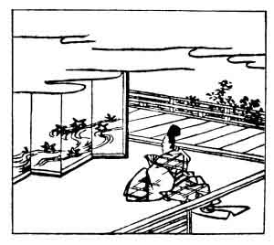

  
[Intangible Textual Heritage](../../index)  [Japan](../index.md) 
[Index](index)  [Previous](hvj017)  [Next](hvj019.md) 

------------------------------------------------------------------------

[Buy this Book on
Kindle](https://www.amazon.com/exec/obidos/ASIN/B002HRE8VG/internetsacredte.md)

------------------------------------------------------------------------

  
*A Hundred Verses from Old Japan (The Hyakunin-isshu)*, tr. by William
N. Porter, \[1909\], at Intangible Textual Heritage

------------------------------------------------------------------------

p. 17

 

### 17

### THE MINISTER NARI-HIRA ARIWARA

### ARIWARA NO NARI-HIRA ASON

  Chi haya furu  
Kami yo mo kikazu  
  Tatsuta gawa  
Kara kurenai ni  
Mizu kuguru to wa.

ALL red with leaves Tatsuta's stream  
  So softly purls along,  
The everlasting Gods themselves,  
  Who judge 'twixt right and wrong,  
  Ne'er heard so sweet a song.

The writer, who lived A.D. 825-880, was the grandson of the Emperor
Saga, and was the Don Juan of Old Japan; he was banished because of an
intrigue he had with the Empress, and his adventures are fully related
in the Ise-Monogatari. The Tatsuta stream is not far from Nara, and is
famous for its maples in autumn. *Chi haya furu*, literally 'thousand
quick brandishing (swords)', is a 'pillow-word', or recognized epithet,
for the Gods, and almost corresponds to Virgil's *Pious Æneas*, and
Homer's '*Odysseus, the son of Zeus, Odysseus of many devices*'. It may
be noted that these 'pillow-words' only occur in the five-syllable
lines, never in the longer lines.

In the picture we see the poet looking at a screen, on which is depicted
the river with the red maple leaves floating on it.

------------------------------------------------------------------------

[Next: 18. The Minister Toshi-yuki Fujiwara: Fujiwara No Toshi-yuki
Ason](hvj019.md)
