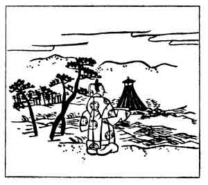

  
[Intangible Textual Heritage](../../index)  [Japan](../index) 
[Index](index)  [Previous](hvj018)  [Next](hvj020) 

------------------------------------------------------------------------

[Buy this Book on
Kindle](https://www.amazon.com/exec/obidos/ASIN/B002HRE8VG/internetsacredte)

------------------------------------------------------------------------

  
*A Hundred Verses from Old Japan (The Hyakunin-isshu)*, tr. by William
N. Porter, \[1909\], at Intangible Textual Heritage

------------------------------------------------------------------------

p. 18

 

### 18

### THE MINISTER TOSHI-YUKI FUJIWARA

### FUJIWARA NO TOSHI-YUKI ASON

  Sumi-no-ye no  
Kishi ni yoru nami  
  Yoru sae ya  
Yume no kayoi-ji  
Hito-me yokuramu.

TO-NIGHT on Sumi-no-ye beach  
  The waves alone draw near;  
And, as we wander by the cliffs,  
  No prying eyes shall peer,  
  No one shall dream we're here.

Toshi-yuki, who lived A.D. 880-907, was an officer of the Imperial
Guard, and a member of the great and influential Fujiwara family. This
family rose into power in the reign of the Emperor Tenchi, and became
almost hereditary ministers-of-state. For a long period the Emperors
chose their wives from this family only, and to this day a large number
of the Japanese nobility are sprung from the same stock. Sumi-no-ye, or
Sumi-yoshi, is in the Province of Settsu, near Kobe.

Note the word *yoru* used twice in the first instance as a verb, meaning
'to approach' and in the next line meaning 'night'. The illustration
shows Toshi-yuki walking on the beach, and evidently waiting for the
lady to join him.

------------------------------------------------------------------------

[Next: 19. The Princess Ise: Ise](hvj020)
