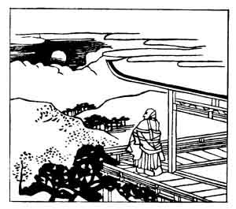

  
[Intangible Textual Heritage](../../index)  [Japan](../index) 
[Index](index)  [Previous](hvj021)  [Next](hvj023) 

------------------------------------------------------------------------

[Buy this Book on
Kindle](https://www.amazon.com/exec/obidos/ASIN/B002HRE8VG/internetsacredte)

------------------------------------------------------------------------

  
*A Hundred Verses from Old Japan (The Hyakunin-isshu)*, tr. by William
N. Porter, \[1909\], at Intangible Textual Heritage

------------------------------------------------------------------------

p. 21

 

### 21

### THE PRIEST SOSEI

### SOSEI HŌSHI

  Ima kon to  
Iishi bakari ni  
  Naga-tsuki no  
Ariake no tsuki  
Wo machi izuru kana.

THE moon that shone the whole night through  
  This autumn morn I see,  
As here I wait thy well-known step,  
  For thou didst promise me—  
  'I'll surely come to thee.'

Sosei is supposed to have been the son of Bishop
Henjō, the writer of verse No. [12](hvj013.htm#page_12), born before the
latter entered the church, about the year 850. His name as a layman was
Hiro-nobu Yoshi-mine, and he became abbot of the Monastery of
Riyau-inwin at Isono-kami, in the Province of Yamato.

------------------------------------------------------------------------

[Next: 22. Yasuhide Bunya: Bunya No Yasuhide](hvj023)
