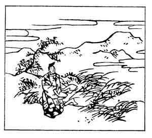

  
[Intangible Textual Heritage](../../index)  [Japan](../index) 
[Index](index)  [Previous](hvj022)  [Next](hvj024) 

------------------------------------------------------------------------

[Buy this Book on
Kindle](https://www.amazon.com/exec/obidos/ASIN/B002HRE8VG/internetsacredte)

------------------------------------------------------------------------

  
*A Hundred Verses from Old Japan (The Hyakunin-isshu)*, tr. by William
N. Porter, \[1909\], at Intangible Textual Heritage

------------------------------------------------------------------------

p. 22

 

### 22

### YASUHIDE BUNYA

### BUNYA NO YASUHIDE

  Fuku kara ni  
Aki no kusa ki no  
  Shiborureba  
Mube yama kaze wo  
Arashi to iuramu.

THE mountain wind in autumn time  
  Is well called 'hurricane';  
It *hurries canes* and twigs along,  
  And whirls them o'er the plain  
  To scatter them again.

This well-known writer lived in the ninth century, and was the father of
Asayasu, who composed verse No. [37](hvj038.htm#page_37); he was also
Vice-Director of the Imperial Bureau of Fabrics.

The point of this verse lies in the ideographic characters of the
original; *yama kaze* (mountain wind) being written with two characters,
which, when combined, form *arashi* (hurricane), and this, of course, it
is quite impossible to reproduce correctly in the translation. The
picture shows the wind blowing down from the mountain behind the poet
and waving his sleeves about.

------------------------------------------------------------------------

[Next: 23. Chisato Ōye: Ōye no Chisato](hvj024)
