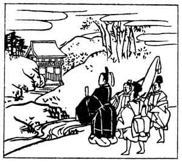

  
[Intangible Textual Heritage](../../index)  [Japan](../index.md) 
[Index](index)  [Previous](hvj024)  [Next](hvj026.md) 

------------------------------------------------------------------------

[Buy this Book on
Kindle](https://www.amazon.com/exec/obidos/ASIN/B002HRE8VG/internetsacredte.md)

------------------------------------------------------------------------

  
*A Hundred Verses from Old Japan (The Hyakunin-isshu)*, tr. by William
N. Porter, \[1909\], at Intangible Textual Heritage

------------------------------------------------------------------------

p. 24

 

### 24

### KWAN-KE

  Kono tabi wa  
Nusa mo tori-aezu  
  Tamuke-yama  
Momiji no nishiki  
Kami no mani-mani.

I BRING no prayers on coloured silk  
  To deck thy shrine to-day,  
But take instead these maple leaves,  
  That grow at Tamuké;  
  Finer than silk are they.

The name given above means 'A house of rushes' but the poet's real name
was Michizane Sugawara; he was a great minister in the Emperor Uda's
reign and a learned scholar; his works comprise twelve books of poetry
and two hundred volumes of history; he was degraded in A.D. 901, and
died two years later, an exile in Kinshū, aged fifty-nine. He is
worshipped as Tenjin Sama, the God of Calligraphy, and is a favourite
deity with schoolboys.

*Nusa* are strips of coloured silk or cloth inscribed with prayers,
which were presented at temples in the old days. Tamuke-yama no
Hachiman, a temple at Nara, is the scene of this verse; it is famous for
its maple leaves, and the poet intended to say, that the crimson colour
of its own maples was finer than any brocade that he could offer.
Another allusion is, that *Tamuke-yama*, near Nara, means 'The Hill of
Offerings'.

------------------------------------------------------------------------

[Next: 25. The Minister-of-the-Right of the Sanjō (District of Kyōto):
Sanjō Udaijin](hvj026.md)
