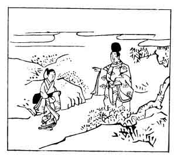

  
[Intangible Textual Heritage](../../index)  [Japan](../index.md) 
[Index](index)  [Previous](hvj025)  [Next](hvj027.md) 

------------------------------------------------------------------------

[Buy this Book on
Kindle](https://www.amazon.com/exec/obidos/ASIN/B002HRE8VG/internetsacredte.md)

------------------------------------------------------------------------

  
*A Hundred Verses from Old Japan (The Hyakunin-isshu)*, tr. by William
N. Porter, \[1909\], at Intangible Textual Heritage

------------------------------------------------------------------------

p. 25

 

### 25

### THE MINISTER-OF-THE-RIGHT OF THE SANJŌ (DISTRICT OF KYŌTO)

### SANJŌ UDAIJIN

  Na ni shi owaba  
Ausaka yama no  
  Sanekazura  
Hito ni shirarede  
Kuru yoshi mo gana.

HEAR thou art as modest as  
  The little creeping spray  
Upon Mount Ōsaka, which hides  
  Beneath the grass; then, pray,  
  Wander with me to-day.

The writer's real name was Sadakata Fujiwara, and he
died A.D. 932. For an account of the Fujiwara family see verse No.
[18](hvj019.htm#page_18.md). Mount Ōsaka mentioned here is the same place
as that referred to in verse No. [10](hvj011.htm#page_10.md), and when
spelled *Ausaka* it means 'a hill of meeting '. The suggestion is, that
if she is really like the creeping vine which grows on Meeting Hill, she
will come and meet him.

------------------------------------------------------------------------

[Next: 26. Prince Tei-shin: Tei-shin Kō](hvj027.md)
