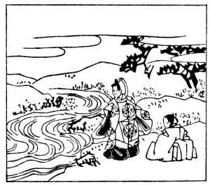

  
[Intangible Textual Heritage](../../index)  [Japan](../index.md) 
[Index](index)  [Previous](hvj027)  [Next](hvj029.md) 

------------------------------------------------------------------------

[Buy this Book on
Kindle](https://www.amazon.com/exec/obidos/ASIN/B002HRE8VG/internetsacredte.md)

------------------------------------------------------------------------

  
*A Hundred Verses from Old Japan (The Hyakunin-isshu)*, tr. by William
N. Porter, \[1909\], at Intangible Textual Heritage

------------------------------------------------------------------------

p. 27

 

### 27

### THE IMPERIAL ADVISER KANESUKE

### CHŪ-NAGON KANESUKE

  Mika no hara  
Wakite nagaruru  
  Izumi gawa  
Itsu miki tote ka  
Koishi-karuramu.

OH! rippling River Izumi,  
  That flows through Mika plain,  
Why should the maid I saw but now  
  And soon shall see again  
  Torment my love-sick brain?

Kanesuke was a member of the Fujiwara family; he died in the year 933.
The River Izumi is in the Province of Yamashiro.

The word-plays in this verse are—*Izumi*, in the third line, which is
imitated in the next line, and *Mika*, which is also repeated in the
third line. The first three lines of this verse, about the river flowing
through the plain, form a 'preface', and appear to be inserted merely
because *itsu miki* (when I have seen her) sounds like *Izumi*.

------------------------------------------------------------------------

[Next: 28. The Minister Mune-yuki Minamoto: Minamoto no Mune-yuki
Ason](hvj029.md)
