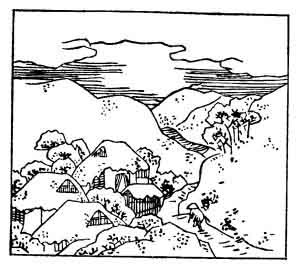

  
[Intangible Textual Heritage](../../index)  [Japan](../index.md) 
[Index](index)  [Previous](hvj028)  [Next](hvj030.md) 

------------------------------------------------------------------------

[Buy this Book on
Kindle](https://www.amazon.com/exec/obidos/ASIN/B002HRE8VG/internetsacredte.md)

------------------------------------------------------------------------

  
*A Hundred Verses from Old Japan (The Hyakunin-isshu)*, tr. by William
N. Porter, \[1909\], at Intangible Textual Heritage

------------------------------------------------------------------------

p. 28

 

### 28

### THE MINISTER MUNE-YUKI MINAMOTO

### MINAMOTO NO MUNE-YUKI ASON

  Yama zato wa  
Fuyu zo sabishisa  
  Masari keru  
Hito-me mo kusa mo  
Karenu to omoeba.

THE mountain village solitude  
  In winter time I dread;  
It seems as if, when friends are gone,  
  And trees their leaves have shed,  
  All men and plants are dead.

The poet was a grandson of the Emperor Kwōkō, and
died A.D. 940. The Minamoto family, who sprang from the Emperor Seiwa,
who reigned 856-877, was at one time very powerful, and produced many
famous men, including Yoritomo, the great founder of the Shōgunate. The
Taira family and the Minamotos were the Yorks and Lancasters of
mediaeval Japan; but, after thirty years of warfare, Yoritomo finally
defeated his rivals in a great battle fought at Dan-no-ura, in the
Straits of Shimonoseki, in 1185; the entire Taira family was
exterminated, including women and children, and the infant Emperor
Antoku. The Minamoto clan themselves became extinct in 1219, when
Sanetomo was murdered at Kamakura, as related in the note to verse No.
[93](hvj094.htm#page_93.md).

------------------------------------------------------------------------

[Next: 29. Mitsune Ōshi-kōchi: Ōshi-kōchi No Mitsune](hvj030.md)
