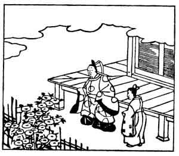

  
[Intangible Textual Heritage](../../index)  [Japan](../index.md) 
[Index](index)  [Previous](hvj029)  [Next](hvj031.md) 

------------------------------------------------------------------------

[Buy this Book on
Kindle](https://www.amazon.com/exec/obidos/ASIN/B002HRE8VG/internetsacredte.md)

------------------------------------------------------------------------

  
*A Hundred Verses from Old Japan (The Hyakunin-isshu)*, tr. by William
N. Porter, \[1909\], at Intangible Textual Heritage

------------------------------------------------------------------------

p. 29

 

### 29

### MITSUNE ŌSHI-KŌCHI

### ŌSHI-KŌCHI NO MITSUNE

  Kokoro-ate ni  
Orabaya oramu  
  Hatsu shimo no  
Oki madowaseru  
Shira giku no hana.

IT was a white chrysanthemum  
  I came to take away;  
But, which are coloured, which are white,  
  I'm half afraid to say,  
  So thick the frost to-day!

Mitsune lived some time in the beginning of the
tenth century, and was one of the compilers of *Odes Ancient and Modern*
(the *Kokinshiu*). The illustration shows him with a boy in attendance,
trying to make up his mind which flower he will pick.

------------------------------------------------------------------------

[Next: 30. Tadamine Nibu: Nibu no Tadamine](hvj031.md)
