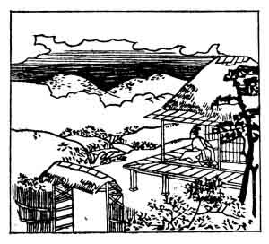

  
[Intangible Textual Heritage](../../index)  [Japan](../index.md) 
[Index](index)  [Previous](hvj030)  [Next](hvj032.md) 

------------------------------------------------------------------------

[Buy this Book on
Kindle](https://www.amazon.com/exec/obidos/ASIN/B002HRE8VG/internetsacredte.md)

------------------------------------------------------------------------

  
*A Hundred Verses from Old Japan (The Hyakunin-isshu)*, tr. by William
N. Porter, \[1909\], at Intangible Textual Heritage

------------------------------------------------------------------------

p. 30

 

### 30

### TADAMINE NIBU

### NIBU NO TADAMINE

  Ariake no  
Tsurenaku mieshi  
  Wakare yori  
Akatsuki bakari  
Uki-mono wa nashi.

I HATE the cold unfriendly moon,  
  That shines at early morn;  
And nothing seems so sad and grey,  
  When I am left forlorn,  
  As day's returning dawn.

The writer lived to the age of ninety-nine, and died in the year 965. He
was, like the composer of the previous verse, one of the compilers of
the Kokinshiu, and was also the father of the author of verse No.
[41](hvj042.htm#page_41.md).

The picture seems to show the poet all alone looking out at the early
dawn, but the moon is not visible.

------------------------------------------------------------------------

[Next: 31. Korenori Saka-no-Uye: Saka-no-Uye no Korenori](hvj032.md)
