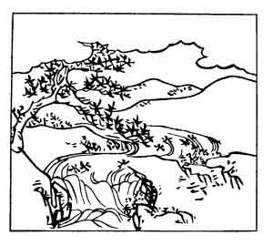

  
[Intangible Textual Heritage](../../index)  [Japan](../index) 
[Index](index)  [Previous](hvj032)  [Next](hvj034) 

------------------------------------------------------------------------

[Buy this Book on
Kindle](https://www.amazon.com/exec/obidos/ASIN/B002HRE8VG/internetsacredte)

------------------------------------------------------------------------

  
*A Hundred Verses from Old Japan (The Hyakunin-isshu)*, tr. by William
N. Porter, \[1909\], at Intangible Textual Heritage

------------------------------------------------------------------------

p. 32

 

### 32

### TSURAKI HARUMICHI

### HARUMICHI NO TSURAKI

  Yama gawa ni  
Kaze no kaketaru  
  Shigarami wa  
Nagare mo aenu  
Momiji nari keri.

THE stormy winds of yesterday  
  The maple branches shook;  
And see! a mass of crimson leaves  
  Has lodged within that nook,  
  And choked the mountain brook.

The writer of this verse died in the year
864.

------------------------------------------------------------------------

[Next: 33. Tomonori Kino: Kino Tomonori](hvj034)
