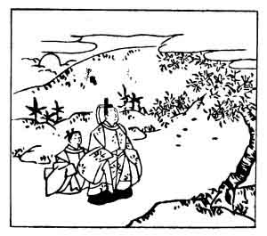

  
[Intangible Textual Heritage](../../index)  [Japan](../index) 
[Index](index)  [Previous](hvj033)  [Next](hvj035) 

------------------------------------------------------------------------

[Buy this Book on
Kindle](https://www.amazon.com/exec/obidos/ASIN/B002HRE8VG/internetsacredte)

------------------------------------------------------------------------

  
*A Hundred Verses from Old Japan (The Hyakunin-isshu)*, tr. by William
N. Porter, \[1909\], at Intangible Textual Heritage

------------------------------------------------------------------------

p. 33

 

### 33

### TOMONORI KINO

### KINO TOMONORI

  Hisakata no  
Hikari nodokeki  
  Haru no hi ni  
Shizu kokoro, naku  
Hana no chiruramu.

THE spring has come, and once again  
  The sun shines in the sky;  
So gently smile the heavens, that  
  It almost makes me cry,  
  When blossoms droop and die.

Tomonori Kino was the grandson of Uchisukune Take, a famous warrior, and
nephew of Tsura-yuki, who composed verse No. [35](hvj036.htm#page_35);
he was one of the compilers of the *Kokinshiu*, and died at the
beginning of the tenth century. He refers in this verse to the fall of
the cherry blossoms.

*Hisakata* is a 'pillow-word' for heaven, without any definite meaning
in the present day; it is generally used in poetry in conjunction with
such words as sun, moon, sky, or, as in this case, 'the light' (of
heaven).

The picture shows the poet with his attendant, watching the petals
falling from the cherry tree.

------------------------------------------------------------------------

[Next: 34. Oki-kaze Fujiwara: Fujiwara No Oki-kaze](hvj035)
