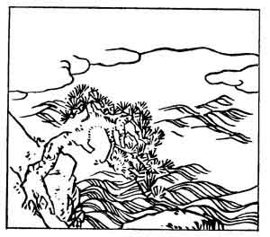

  
[Intangible Textual Heritage](../../index)  [Japan](../index.md) 
[Index](index)  [Previous](hvj034)  [Next](hvj036.md) 

------------------------------------------------------------------------

[Buy this Book on
Kindle](https://www.amazon.com/exec/obidos/ASIN/B002HRE8VG/internetsacredte.md)

------------------------------------------------------------------------

  
*A Hundred Verses from Old Japan (The Hyakunin-isshu)*, tr. by William
N. Porter, \[1909\], at Intangible Textual Heritage

------------------------------------------------------------------------

p. 34

 

### 34

### OKI-KAZE FUJIWARA

### FUJIWARA NO OKI-KAZE

  Tare wo ka mo  
Shiru hito nisemu  
  Takasago no  
Matsu mo mukashi no  
Tomo nara-naku ni.

GONE are my old familiar friends,  
  The men I used to know;  
Yet still on Takasago beach  
  The same old pine trees-grow,  
  That I knew long ago.

Oki-kaze, the son of Michinari, was an official in
the Province of Sagami in the year 911; the date of his death is
unknown, but he is mentioned as being alive as late as the year 914.
Takasago, which is mentioned again in verse No.
[73](hvj074.htm#page_73.md), is a seaside place in the Province of Harima,
famous for its pine trees; the pine tree is one of the recognized
emblems of long life in Japan, because it is believed that after a
thousand years its sap turns to amber.

------------------------------------------------------------------------

[Next: 35. Tsura-yuki Kino: Kino Tsura-yuki](hvj036.md)
