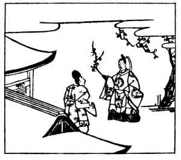

  
[Intangible Textual Heritage](../../index)  [Japan](../index) 
[Index](index)  [Previous](hvj035)  [Next](hvj037) 

------------------------------------------------------------------------

[Buy this Book on
Kindle](https://www.amazon.com/exec/obidos/ASIN/B002HRE8VG/internetsacredte)

------------------------------------------------------------------------

  
*A Hundred Verses from Old Japan (The Hyakunin-isshu)*, tr. by William
N. Porter, \[1909\], at Intangible Textual Heritage

------------------------------------------------------------------------

p. 35

 

### 35

### TSURA-YUKI KINO

### KINO TSURA-YUKI

  Hito wa iza  
Kokoro mo shirazu  
  Furu sato wa  
Hana zo mukashi no  
Ka ni nioi keru.

THE village of my youth is gone,  
  New faces meet my gaze;  
But still the blossoms at thy gate,  
  Whose perfume scents the ways,  
  Recall my childhood's days.

The writer of this verse, who lived A.D. 884-946,
was a nobleman at Court, one of the greatest of the classical poets, and
the first writer of Japanese prose. He was the chief compiler of the
*Kokinshiu*, in which work he was assisted by the authors of verses Nos.
[29](hvj030.htm#page_29), [30](hvj031.htm#page_30) and
[33](hvj034.htm#page_33). This work consists of twenty volumes,
containing some eleven hundred verses, and was completed in the year
922. It is related that Tsura-yuki once visited a friend after a long
absence; and on being asked jestingly by the latter, how he could
remember the way after such a long interval of time, the poet broke off
a spray of blossoms from a plum tree growing at the entrance, and
presented it to his friend with this impromptu verse.

------------------------------------------------------------------------

[Next: 36. Fuka-yabu Kiyowara: Kiyowara no Fuka-yabu](hvj037)
