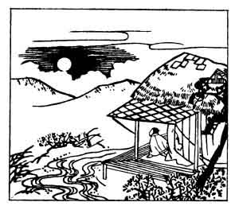

  
[Intangible Textual Heritage](../../index)  [Japan](../index) 
[Index](index)  [Previous](hvj036)  [Next](hvj038) 

------------------------------------------------------------------------

[Buy this Book on
Kindle](https://www.amazon.com/exec/obidos/ASIN/B002HRE8VG/internetsacredte)

------------------------------------------------------------------------

  
*A Hundred Verses from Old Japan (The Hyakunin-isshu)*, tr. by William
N. Porter, \[1909\], at Intangible Textual Heritage

------------------------------------------------------------------------

p. 36

 

### 36

### FUKA-YABU KIYOWARA

### KIYOWARA NO FUKA-YABU

  Natsu no yo wa  
Mada yoi nagara  
  Akenuru wo  
Kumo no izuko ni  
Tsuki yadoruramu.

Too short the lovely summer night,  
  Too soon ’tis passed away;  
I watched to see behind which cloud  
  The moon would chance to stay,  
  And here's the dawn of day!

Nothing is known of this writer, except that he was
the father of the author of verse No. [42](hvj043.htm#page_42).

------------------------------------------------------------------------

[Next: 37. Asayasu Bunya: Bunya no Asayasu](hvj038)
