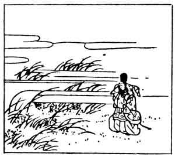

  
[Intangible Textual Heritage](../../index)  [Japan](../index) 
[Index](index)  [Previous](hvj037)  [Next](hvj039) 

------------------------------------------------------------------------

[Buy this Book on
Kindle](https://www.amazon.com/exec/obidos/ASIN/B002HRE8VG/internetsacredte)

------------------------------------------------------------------------

  
*A Hundred Verses from Old Japan (The Hyakunin-isshu)*, tr. by William
N. Porter, \[1909\], at Intangible Textual Heritage

------------------------------------------------------------------------

p. 37

 

### 37

### ASAYASU BUNYA

### BUNYA NO ASAYASU

  Shira tsuyu ni  
Kaze no fukishiku  
  Aki no no wa  
Tsuranuki-tomenu  
Tama zo chiri keru.

THIS lovely morn the dewdrops flash  
  Like diamonds on the grass—  
A blaze of sparkling jewels! But  
  The autumn wind, alas!  
  Scatters them as I pass.

Asayasu, the son of the author of verse No. 22,
lived about the end of the ninth century. He is said to have composed
this verse at the request of the Emperor Daigo in the year 900. To liken
the dewdrops to jewels or beads (*tama*) is typical of Japanese verse.
The picture shows the grass, and the dewdrops scattered on the ground in
front of the poet.

------------------------------------------------------------------------

[Next: 38. Ukon](hvj039)
