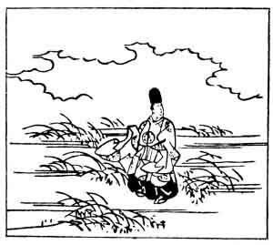

  
[Intangible Textual Heritage](../../index)  [Japan](../index) 
[Index](index)  [Previous](hvj039)  [Next](hvj041) 

------------------------------------------------------------------------

[Buy this Book on
Kindle](https://www.amazon.com/exec/obidos/ASIN/B002HRE8VG/internetsacredte)

------------------------------------------------------------------------

  
*A Hundred Verses from Old Japan (The Hyakunin-isshu)*, tr. by William
N. Porter, \[1909\], at Intangible Textual Heritage

------------------------------------------------------------------------

p. 39

 

### 39

### THE PRIVY COUNCILLOR HITOSHI

### SANGI HITOSHI

  Asajū no  
Ono no shinowara  
  Shinoburedo  
Amarite nado ka  
Hito no koishiki.

’TIS easier to hide the reeds  
  Upon the moor that grow,  
Than try to hide the ardent love  
  That sets my cheeks aglow  
  For somebody I know.

Little is known of this poet, except that he lived some time in the
tenth century.

Note the word *shinowara*, meaning 'a bamboo moor', contrasted with
*shinohuredo* in the next line, which means 'though I might manage to
conceal'.

The picture shows Hitoshi on the wild moor, with the reeds growing all
around him.

------------------------------------------------------------------------

[Next: 40. Kanemori Taira: Taira no Kanemori](hvj041)
