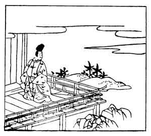

  
[Intangible Textual Heritage](../../index)  [Japan](../index) 
[Index](index)  [Previous](hvj041)  [Next](hvj043) 

------------------------------------------------------------------------

[Buy this Book on
Kindle](https://www.amazon.com/exec/obidos/ASIN/B002HRE8VG/internetsacredte)

------------------------------------------------------------------------

  
*A Hundred Verses from Old Japan (The Hyakunin-isshu)*, tr. by William
N. Porter, \[1909\], at Intangible Textual Heritage

------------------------------------------------------------------------

p. 41

 

### 41

### TADAMI NIBU

### NIBU NO TADAMI

  Koi su tefu  
Waga na wa madaki  
  Tachi ni keri  
Hito shirezu koso  
Omoi-someshi ga.

OUR courtship, that we tried to hide,  
  Misleading is to none;  
And yet how could the neighbours guess,  
  That I had yet begun  
  To fancy any one?

This poet was the son of the writer of verse No.
[30](hvj031.htm#page_30), and he is said to have composed the poem on
the same occasion as is mentioned for No. [40](hvj041.htm#page_40).

The word *omoi* in the last line is a 'pivot-word' used firstly in
connexion with the fourth line, meaning 'I thought' (nobody knew), and
also in conjunction with *someshi*, where it means 'I began to be in
love'.

------------------------------------------------------------------------

[Next: 42. Moto-suke Kiyowara: Kiyowara no Moto-suke](hvj043)
