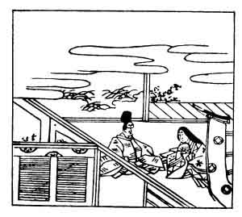

  
[Intangible Textual Heritage](../../index)  [Japan](../index) 
[Index](index)  [Previous](hvj043)  [Next](hvj045) 

------------------------------------------------------------------------

[Buy this Book on
Kindle](https://www.amazon.com/exec/obidos/ASIN/B002HRE8VG/internetsacredte)

------------------------------------------------------------------------

  
*A Hundred Verses from Old Japan (The Hyakunin-isshu)*, tr. by William
N. Porter, \[1909\], at Intangible Textual Heritage

------------------------------------------------------------------------

p. 43

 

### 43

### THE IMPERIAL ADVISER YATSU-TADA

### CHŪ-NAGON YATSU-TADA

  Ai-mite no  
Nochi no kokoro ni  
  Kurabureba  
Mukashi wa mono wo  
Omowazari keri.

HOW desolate my former life,  
  Those dismal years, ere yet  
I chanced to see thee face to face  
  ’Twere better to forget  
  Those days before we met.

Yatsu-tada was a member of the great Fujiwara family, and is said to
have died in the year 943,

It is interesting to note in these illustrations, as in nearly all old
Japanese pictures, that the artist either takes off the roof of the
house or removes part of the wall when he wishes you to see what is
going on indoors.

------------------------------------------------------------------------

[Next: 44. The Imperial Adviser Asa-tada: Chū-Nagon Asa-tada](hvj045)
