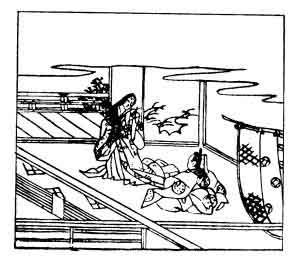

  
[Intangible Textual Heritage](../../index)  [Japan](../index.md) 
[Index](index)  [Previous](hvj045)  [Next](hvj047.md) 

------------------------------------------------------------------------

[Buy this Book on
Kindle](https://www.amazon.com/exec/obidos/ASIN/B002HRE8VG/internetsacredte.md)

------------------------------------------------------------------------

  
*A Hundred Verses from Old Japan (The Hyakunin-isshu)*, tr. by William
N. Porter, \[1909\], at Intangible Textual Heritage

------------------------------------------------------------------------

p. 45

 

### 45

### PRINCE KEN-TOKU

### KEN-TOKU KO

  Aware to mo  
Iu beki hito wa  
  Omohoede  
Mi no itazura ni  
Narinu beki kana.

I DARE not hope my lady-love  
  Will smile on me again;  
She knows no Pity, and my life  
  I care not to retain,  
  Since all my prayers are vain.

The real name of the writer of this verse was Koretada Fujiwara; he died
in the year 972, and Prince Ken-toku is his posthumous name.

*Aware to mo* means, in conjunction with the next line, 'that she would
give me words of pity'; but *aware tomo* can also mean 'to meet as a
friend.'

In spite of the Prince's fears, the illustration seems to suggest that
his lady-love changed her mind, and came to visit him once more.

------------------------------------------------------------------------

[Next: 46. The Priest Ne-yoshi-tada: Sō Ne-yoshi-tada](hvj047.md)
