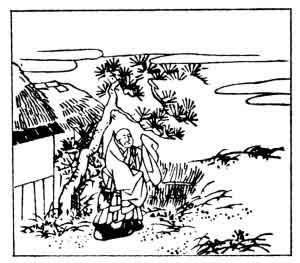

  
[Intangible Textual Heritage](../../index)  [Japan](../index) 
[Index](index)  [Previous](hvj047)  [Next](hvj049) 

------------------------------------------------------------------------

[Buy this Book on
Kindle](https://www.amazon.com/exec/obidos/ASIN/B002HRE8VG/internetsacredte)

------------------------------------------------------------------------

  
*A Hundred Verses from Old Japan (The Hyakunin-isshu)*, tr. by William
N. Porter, \[1909\], at Intangible Textual Heritage

------------------------------------------------------------------------

p. 47

 

### 47

### THE PRIEST YE-KEI

### YE-KEI HŌSHI

  Yaemugura  
Shigereru yado no  
  Sabishiki ni  
Hito koso miene  
Aki wa ki ni keri.

MY little temple stands alone,  
  No other hut is near;  
No one will pass to stop and praise  
  Its vine-grown roof, I fear,  
  Now that the autumn's here.

The Priest Ye-kei lived about the end of the tenth
century, but nothing is known about him. In the picture he is shown
outside his humble little temple with its patched roof and the vine
growing up the wall.

------------------------------------------------------------------------

[Next: 48. Shige-yuki Minamoto: Minamoto no Shige-yuki](hvj049)
