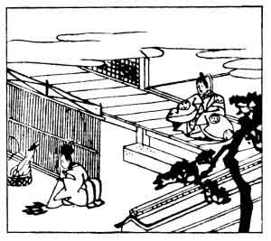

  
[Intangible Textual Heritage](../../index)  [Japan](../index) 
[Index](index)  [Previous](hvj049)  [Next](hvj051) 

------------------------------------------------------------------------

[Buy this Book on
Kindle](https://www.amazon.com/exec/obidos/ASIN/B002HRE8VG/internetsacredte)

------------------------------------------------------------------------

  
*A Hundred Verses from Old Japan (The Hyakunin-isshu)*, tr. by William
N. Porter, \[1909\], at Intangible Textual Heritage

------------------------------------------------------------------------

p. 49

 

### 49

### THE MINISTER YOSHI-NOBU, OF PRIESTLY RANK

### ŌNAKATOMI NO YOSHI-NOBU ASON

  Mikaki mori  
Eji no taku hi no  
  Yo wa moete  
Hiru wa kie-tsutsu  
Mono wo koso omoe.

MY constancy to her I love  
  I never will forsake;  
As surely as the Palace Guards  
  Each night their watch-fire make  
  And guard it till daybreak.

The author was the son of the Minister Yorimoto, and
he lived during the latter part of the tenth century. The illustration
shows the watchman outside the Palace tending his fire.

------------------------------------------------------------------------

[Next: 50. Yoshitaka Fujiwara: Fujiwara no Yoshitaka](hvj051)
