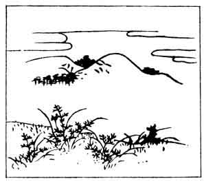

  
[Intangible Textual Heritage](../../index)  [Japan](../index) 
[Index](index)  [Previous](hvj051)  [Next](hvj053) 

------------------------------------------------------------------------

[Buy this Book on
Kindle](https://www.amazon.com/exec/obidos/ASIN/B002HRE8VG/internetsacredte)

------------------------------------------------------------------------

  
*A Hundred Verses from Old Japan (The Hyakunin-isshu)*, tr. by William
N. Porter, \[1909\], at Intangible Textual Heritage

------------------------------------------------------------------------

p. 51

 

### 51

### THE MINISTER SANEKATA FUJIWARA

### FUJIWARA NO SANEKATA ASON

  Kaku to dani  
Eyawa Ibuki no  
  Sashi-mogusa  
Sashimo shiraji na  
Moyuru omoi wo.

THOUGH love, like blisters made from leaves  
  Grown on Mount Ibuki,  
Torments me more than I can say,  
  My lady shall not see,  
  How she is paining me.

The writer lived some time at the close of the tenth
century. The artemisia plant (or mugwort) is used in Japan for
cauterizing; a conical wad of the leaves or blossoms is placed on the
spot, lit at the top, and allowed to burn down to the skin; this
produces a blister, and is extremely painful. Ibuki is a hill, between
the Provinces of Omi and Mino, famous for its artemisia, but *ibuki* can
also stand for *iu beki*, which, in conjunction with *e ya wa*, would
mean, 'Ah! how could I tell her!' But *eyawa* as one word means
'indescribable!' Notice also *sashimo* in the third and fourth lines
*sashi-mogusa* means 'the artemisia plant', but *sashi mo* means 'even
though it is smarting'; *sashimo*, in one word, can also mean 'in such a
way'. This verse is a very good example of the way the Japanese love to
play upon words. The picture seems to show Mount Ibuki with the mugwort
growing on it.

------------------------------------------------------------------------

[Next: 52. The Minister Michi-nobu Fujiwara: Fujiwara no Michi-nobu
Ason](hvj053)
