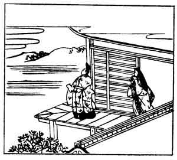

  
[Intangible Textual Heritage](../../index)  [Japan](../index) 
[Index](index)  [Previous](hvj052)  [Next](hvj054) 

------------------------------------------------------------------------

[Buy this Book on
Kindle](https://www.amazon.com/exec/obidos/ASIN/B002HRE8VG/internetsacredte)

------------------------------------------------------------------------

  
*A Hundred Verses from Old Japan (The Hyakunin-isshu)*, tr. by William
N. Porter, \[1909\], at Intangible Textual Heritage

------------------------------------------------------------------------

p. 52

 

### 52

### THE MINISTER MICHI-NOBU FUJIWARA

### FUJIWARA NO MICHI-NOBU ASON

  Akenureba  
Kururu mono to wa  
  Shiri nagara  
Nao urameshiki  
Asaborake kana.

ALTHOUGH I know the gentle night  
  Will surely follow morn,  
Yet, when I'm wakened by the sun,  
  Turn over, stretch and yawn—  
  How I detest the dawn!

Michi-nobu lived in the tenth century. He is shown
in the illustration with his wife on the verandah, watching the day
break.

------------------------------------------------------------------------

[Next: 53. The Mother of Michi-tsuna, Commander of the Right Imperial
Guard: Udaishō Michi-tsuna no Haha](hvj054)
