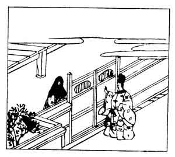

  
[Intangible Textual Heritage](../../index)  [Japan](../index) 
[Index](index)  [Previous](hvj053)  [Next](hvj055) 

------------------------------------------------------------------------

[Buy this Book on
Kindle](https://www.amazon.com/exec/obidos/ASIN/B002HRE8VG/internetsacredte)

------------------------------------------------------------------------

  
*A Hundred Verses from Old Japan (The Hyakunin-isshu)*, tr. by William
N. Porter, \[1909\], at Intangible Textual Heritage

------------------------------------------------------------------------

p. 53

 

### 53

### THE MOTHER OF MICHI-TSUNA, COMMANDER OF THE RIGHT IMPERIAL GUARD

### UDAISHŌ MICHI-TSUNA NO HAHA

  Nageki-tsutsu  
Hitori nuru yo no  
  Akuru ma wa  
Ikani hisashiki  
Mono to kawa shiru.

ALL through the long and dreary night  
  I lie awake and moan;  
How desolate my chamber feels,  
  How weary I have grown  
  Of being left alone!

This lady was the daughter of Motoyasu Fujiwara, and the wife of the
Regent Kaneie; she was famous for her beauty, and lived in the reign of
the Emperor Mura-kami (947-967). It is related, that her husband
returned home late one night, and, having to wait a moment or two before
she let him in, he angrily reproached her, and she replied with this
verse (see illustration).

*Yo no akuru ma* means 'until the dawn', but *akuru ma* also suggests
that the room is empty when he is away.

------------------------------------------------------------------------

[Next: 54. The Mother of the Minister of State: Gidō-sanshi no
Haha](hvj055)
