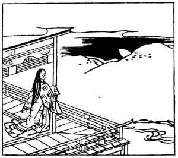

  
[Intangible Textual Heritage](../../index)  [Japan](../index.md) 
[Index](index)  [Previous](hvj059)  [Next](hvj061.md) 

------------------------------------------------------------------------

[Buy this Book on
Kindle](https://www.amazon.com/exec/obidos/ASIN/B002HRE8VG/internetsacredte.md)

------------------------------------------------------------------------

  
*A Hundred Verses from Old Japan (The Hyakunin-isshu)*, tr. by William
N. Porter, \[1909\], at Intangible Textual Heritage

------------------------------------------------------------------------

p. 59

 

### 59

### AKAZOME EMON

  Yasurawade  
Nenamaji mono wo  
  Sayofukete  
Katabuku made no  
Tsuki wo mishi kana.

WAITING and hoping for thy step,  
  Sleepless in bed I lie,  
All through the night, until the moon,  
  Leaving her post on high,  
  Slips sideways down the sky.

This writer is again a lady; she is said to have
addressed the verse to Michinaga Fujiwara, who held the office of Regent
under the Emperor Ichijō (A.D. 987-1011) and his two successors. Regent
here must be understood not exactly as a temporary or vice Emperor, but
rather as the Emperor's confidential adviser, and the official through
whom all communications were made. Notice the moon in the illustration
just disappearing behind the hill.

------------------------------------------------------------------------

[Next: 60. Lady-in-Waiting Ko-shikibu: Ko-shikibu no Naishi](hvj061.md)
