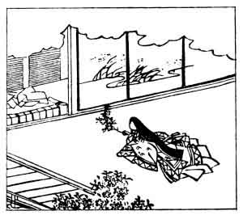

  
[Intangible Textual Heritage](../../index)  [Japan](../index.md) 
[Index](index)  [Previous](hvj061)  [Next](hvj063.md) 

------------------------------------------------------------------------

[Buy this Book on
Kindle](https://www.amazon.com/exec/obidos/ASIN/B002HRE8VG/internetsacredte.md)

------------------------------------------------------------------------

  
*A Hundred Verses from Old Japan (The Hyakunin-isshu)*, tr. by William
N. Porter, \[1909\], at Intangible Textual Heritage

------------------------------------------------------------------------

p. 61

 

### 61

### THE LADY ISE

### ISE NO TAIU

  Inishie no  
Nara no Miyako no  
  Yaezakura  
Kyō kokonoe ni  
Nioi nuru kana.

THE double cherry trees, which grew  
  At Nara in past days,  
Now beautify this Palace, and  
  Their blossoms all ablaze  
  Perfume the royal ways.

The Lady Ise was another of the famous literary women, that
distinguished the Imperial Court at the end of the tenth century; she
was associated with the Province of Ise, from which she gets her name.
Nara was the capital city from A.D. 709 to 784, after which the Court
moved to Kyōto. It is related, that during the reign of the Emperor
Ichijō (A.D. 987-1011) a nobleman presented him with a spray of the
eight-petalled cherry trees that grew at Nara; the Emperor was so
delighted, that he had the trees, or perhaps cuttings from them, brought
to Kyōto, and this verse commemorates the event.

*Kokonoe* (Palace) really means 'ninefold', and refers to the nine
enclosures of the Imperial Residence; it is here contrasted with
*yaezakura*, the eightfold or double cherry blossom.

------------------------------------------------------------------------

[Next: 62. The Lady Sei: Sei Shō-nagon](hvj063.md)
