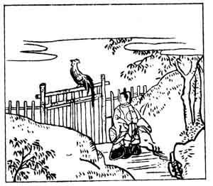

  
[Intangible Textual Heritage](../../index)  [Japan](../index.md) 
[Index](index)  [Previous](hvj062)  [Next](hvj064.md) 

------------------------------------------------------------------------

[Buy this Book on
Kindle](https://www.amazon.com/exec/obidos/ASIN/B002HRE8VG/internetsacredte.md)

------------------------------------------------------------------------

  
*A Hundred Verses from Old Japan (The Hyakunin-isshu)*, tr. by William
N. Porter, \[1909\], at Intangible Textual Heritage

------------------------------------------------------------------------

p. 62

 

### 62

### THE LADY SEI

### SEI SHŌ-NAGON

  Yo wo komete  
Tori no sorane wa  
  Hakaru tomo  
Yo ni Ausaka no  
Seki wa yurusaji.

Too long to-night you've lingered here,  
  And, though you imitate  
The crowing of a cock, 'twill not  
  Unlock the tollbar gate;  
  Till daylight must you wait.

The Lady Sei, Shō-nagon being merely a title, was
the daughter of the writer of verse No. [42](hvj043.htm#page_42.md), and
the authoress of *Makura-no-Sōshi*, or 'A story book to keep under one's
pillow'; she was, with the writer of verse No. [57](hvj058.htm#page_57.md),
one of the greatest of Japanese authors. She was a lady-in-waiting at
Court, and retired to a convent in the year 1000. This verse has
reference to the Chinese story of Prince Tan Chu, who was shut up with
his retainers in the town of Kankokkan; the city gates were closed from
sunset to cockcrow, but during the night one of the Prince's followers
so successfully imitated the crowing of a cock, that the guards,
thinking it was daybreak, opened the gates, and the fugitives escaped
under cover of the darkness. It is related, that the Emperor once
noticed Lady Sei admiring the freshly fallen snow, and asked 'How is the
snow of Korohō?' She at once raised the window curtain, showing that she
recognized the allusion to the verse 'The snow of Korohō is seen by
raising the curtain'.

------------------------------------------------------------------------

[Next: 63. The Shinto Official Michimasa, of the Left Side of the
Capital: Sakyō Taiu Michimasa](hvj064.md)
