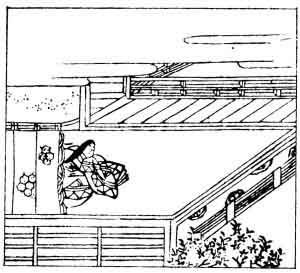

  
[Intangible Textual Heritage](../../index)  [Japan](../index.md) 
[Index](index)  [Previous](hvj065)  [Next](hvj067.md) 

------------------------------------------------------------------------

[Buy this Book on
Kindle](https://www.amazon.com/exec/obidos/ASIN/B002HRE8VG/internetsacredte.md)

------------------------------------------------------------------------

  
*A Hundred Verses from Old Japan (The Hyakunin-isshu)*, tr. by William
N. Porter, \[1909\], at Intangible Textual Heritage

------------------------------------------------------------------------

p. 65

 

### 65

### SAGAMI

  Urami wabi  
Hosanu sode dani  
  Aru mono wo  
Koi ni kuchinamu  
Na koso oshikere.

BE not displeased, but pardon me,  
  If still my tears o’erflow;  
My lover's gone, and my good name,  
  Which once I valued so,  
  I fear must also go.

This lady was the wife of Kinsuke Ōye, the Governor
of the Province of Sagami, from which she got her name. The verse is
said to have been composed at an Imperial poetical contest in the year
1051. The incidents mentioned in these verses are not all supposed to
have really taken place; many of the poems, including this one, were
simply written on a given subject for one of the poetical contests,
which were so common at the period.

------------------------------------------------------------------------

[Next: 66. The Archbishop Gyōson: Daisōjō Gyōson](hvj067.md)
